# 🏛️ Estrutura Organizacional

Estrutura oficial da EcoCria — leve, clara e prática.

> Uma pessoa pode ocupar vários papéis. O importante é **clareza** sobre quem decide, planeja, supervisiona e executa.

---

## 🧱 Níveis

| Nível | Função |
|-------|--------|
| **Estratégico** | Visão, identidade, metas anuais, parcerias |
| **Tático** | Transforma visão em planos por área |
| **Gerencial** | Supervisão diária, qualidade, comunicação |
| **Operacional** | Execução artesanal, atendimento, logística |

---

## 📊 Organograma

```mermaid
graph TB
    %% ================= NÍVEL ESTRATÉGICO =================
    CEO[🌿 CEO<br/>Direção & Estratégia]

    %% Filhos Estratégicos → Áreas Táticas
    CEO --> PROD_TAT[🪵 Coord. Operações & Produção]
    CEO --> PRODUTO_TAT[🎨 Coord. Produto & Catálogo Digital]
    CEO --> COM_TAT[🛒 Coord. Comercial & Distribuição]
    CEO --> FIN_TAT[💰 Coord. Financeiro & Compras]
    CEO --> PESS_TAT[❤️ Coord. Pessoas & Cultura]

    %% ================= NÍVEL TÁTICO → GERENCIAL =================
    PROD_TAT --> PROD_GER[🛠️ Supervisor de Produção]
    PROD_TAT --> QUALI_GER[🔍 Supervisor de Qualidade]

    PRODUTO_TAT --> FOTO_GER[📷 Supervisor de Fotografia & Atualização de Produtos]

    COM_TAT --> COM_GER[📦 Supervisor Comercial & Envios]

    FIN_TAT --> FIN_GER[📋 Supervisor Financeiro]

    PESS_TAT --> ROTINA_GER[🌱 Supervisor de Rotina & Bem-Estar]

    %% ================= NÍVEL GERENCIAL → OPERACIONAL =================
    PROD_GER --> ARTESAOS[🔨 Artesãos & Execução]
    QUALI_GER --> ACABA[🧴 Acabamento & Embalagem]

    FOTO_GER --> DIGITAL[🖼️ Catalogação Digital & Atualização de Preços]

    COM_GER --> ATEND[💬 Atendimento & Mensagens]
    COM_GER --> ENVIO[📮 Preparação de Pedidos]
    COM_GER --> FEIRA[🛍️ Banca de Feiras]

    FIN_GER --> REG_FIN[📝 Registro Financeiro]
    FIN_GER --> CUSTOS[💲 Custos & Controle de Estoque]

    ROTINA_GER --> SEG_ATELIER[🧯 Segurança & Organização]

    %% ================= CORES =================
    %% Estratégico
    style CEO fill:#e3f2fd,stroke:#1976d2,stroke-width:3px,color:#000

    %% Tático
    style PROD_TAT fill:#e8f5e9,stroke:#43a047,stroke-width:2px,color:#000
    style PRODUTO_TAT fill:#e8f5e9,stroke:#43a047,stroke-width:2px,color:#000
    style COM_TAT fill:#e8f5e9,stroke:#43a047,stroke-width:2px,color:#000
    style FIN_TAT fill:#e8f5e9,stroke:#43a047,stroke-width:2px,color:#000
    style PESS_TAT fill:#e8f5e9,stroke:#43a047,stroke-width:2px,color:#000

    %% Gerencial
    style PROD_GER fill:#fff9c4,stroke:#f9a825,stroke-width:2px,color:#000
    style QUALI_GER fill:#fff9c4,stroke:#f9a825,stroke-width:2px,color:#000
    style FOTO_GER fill:#fff9c4,stroke:#f9a825,stroke-width:2px,color:#000
    style COM_GER fill:#fff9c4,stroke:#f9a825,stroke-width:2px,color:#000
    style FIN_GER fill:#fff9c4,stroke:#f9a825,stroke-width:2px,color:#000
    style ROTINA_GER fill:#fff9c4,stroke:#f9a825,stroke-width:2px,color:#000

    %% Operacional
    style ARTESAOS fill:#ffe0b2,stroke:#fb8c00,stroke-width:1px,color:#000
    style ACABA fill:#ffe0b2,stroke:#fb8c00,stroke-width:1px,color:#000
    style DIGITAL fill:#ffe0b2,stroke:#fb8c00,stroke-width:1px,color:#000
    style ATEND fill:#ffe0b2,stroke:#fb8c00,stroke-width:1px,color:#000
    style ENVIO fill:#ffe0b2,stroke:#fb8c00,stroke-width:1px,color:#000
    style FEIRA fill:#ffe0b2,stroke:#fb8c00,stroke-width:1px,color:#000
    style REG_FIN fill:#ffe0b2,stroke:#fb8c00,stroke-width:1px,color:#000
    style CUSTOS fill:#ffe0b2,stroke:#fb8c00,stroke-width:1px,color:#000
    style SEG_ATELIER fill:#ffe0b2,stroke:#fb8c00,stroke-width:1px,color:#000

```

---

## 📦 Responsabilidades por Área

| Área | Responsabilidades |
|------|-------------------|
| **Operações & Produção** | Lotes, materiais, ferramentas, prazos |
| **Produto & Catálogo** | Novos modelos, fotos, descrições, preços |
| **Comercial** | Atendimento, envios, feiras, estoque digital |
| **Financeiro** | Entradas/saídas, custos, margens, preços |
| **Pessoas & Cultura** | Ritmo, segurança, alinhamento, prioridades |

---

## 🗓️ Rotina Semanal

| Dia | Duração | Foco |
|-----|---------|------|
| **Segunda** | 15 min | Alinhamento: 3 prioridades, responsáveis |
| **Quarta** | 1 bloco | Criativo: prototipar, fotografar, registrar |
| **Sexta** | 10 min | Fechamento: o que avançou, próximos passos |
| **Fim de semana** | — | Descanso obrigatório |

---

## 🎯 Regras de Uso

- Cada tarefa no Kanban = 1 etiqueta de área
- CEO decide portfólio, padrões, foco macro
- Supervisão leve com check-ins curtos
- Atualizar catálogo a cada novo produto
- Revisar estrutura a cada trimestre

---

  🌿 <strong>EcoCria</strong> — Organização simples, criativa e funcional.

