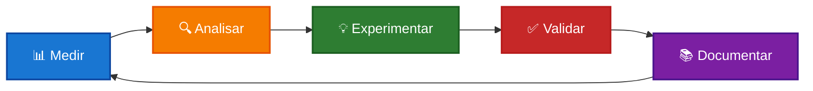

# ♻️ Evolução Contínua — Melhoria Constante

> **Nunca pare de melhorar**: transforme sua empresa em organismo vivo que aprende e evolui.

---

## 💡 O Que É Evolução Contínua?

**Evolução Contínua** é a prática de melhorar constantemente processos, estrutura e operação da empresa através de:

- 🔄 **Ciclos de aprendizado** regulares
- 📊 **Dados e evidências** para decisões
- 🎯 **Pequenas melhorias** incrementais
- 🚀 **Experimentação** controlada
- 📚 **Documentação** de aprendizados

!!! tip "Por que evolução contínua importa?"
    - **Adaptação**: Empresa se ajusta a mudanças do mercado
    - **Competitividade**: Melhora constante mantém vantagem
    - **Eficiência**: Processos ficam mais enxutos
    - **Engajamento**: Equipe participa ativamente
    - **Sustentabilidade**: Crescimento saudável e duradouro

---

## 🔄 Ciclo de Evolução

### 1. Medir

**O que fazer:**

- Colete dados dos indicadores
- Identifique padrões
- Detecte anomalias
- Compare com metas

**Ferramentas:**

- Indicadores do Painel
- Métricas do Quadro
- Feedback de clientes
- Observações da equipe

---

### 2. Analisar

**O que fazer:**

- Entenda causas
- Identifique oportunidades
- Priorize melhorias
- Formule hipóteses

**Técnicas:**

- 5 Whys (causa raiz)
- Pareto (80/20)
- Retrospectivas
- Análise de dados

---

### 3. Experimentar

**O que fazer:**

- Teste pequenas mudanças
- Documente experimento
- Defina critérios de sucesso
- Estabeleça prazo

**Princípios:**

- Comece pequeno
- Teste rápido
- Aprenda cedo
- Ajuste conforme necessário

---

### 4. Validar

**O que fazer:**

- Compare resultados com hipótese
- Meça impacto real
- Colete feedback
- Decida: escalar, ajustar ou descartar

**Critérios:**

- Atingiu objetivo?
- Gerou valor?
- É sustentável?
- Vale escalar?

---

### 5. Documentar

**O que fazer:**

- Registre aprendizados
- Atualize processos
- Compartilhe conhecimento
- Celebre conquistas

**Onde documentar:**

- Retrospectivas
- Painel (se estratégico)
- Processos atualizados
- Base de conhecimento

---

## 🎯 Áreas de Evolução

### 1. Processos Operacionais

**O que melhorar:**

- Fluxos de trabalho
- Checklists
- Automações
- Padrões de qualidade

**Como:**

- Mapeie processo atual
- Identifique gargalos
- Teste melhorias
- Padronize o que funciona

---

### 2. Estrutura Organizacional

**O que melhorar:**

- Papéis e responsabilidades
- Setores e áreas
- Fluxo de comunicação
- Tomada de decisão

**Como:**

- Revise no ritual trimestral
- Ajuste conforme crescimento
- Teste novas estruturas
- Documente mudanças

---

### 3. Rituais de Gestão

**O que melhorar:**

- Duração dos rituais
- Etapas e formato
- Frequência
- Participantes

**Como:**

- Colete feedback da equipe
- Teste variações
- Meça eficácia
- Ajuste gradualmente

---

### 4. Produtos e Serviços

**O que melhorar:**

- Qualidade
- Variedade
- Precificação
- Experiência do cliente

**Como:**

- Ouça clientes
- Teste novidades
- Meça satisfação
- Itere rapidamente

---

### 5. Cultura e Pessoas

**O que melhorar:**

- Comunicação
- Colaboração
- Aprendizado
- Bem-estar

**Como:**

- Pesquisas de clima
- Conversas 1:1
- Experimentos culturais
- Celebrações

---

## 📊 Framework de Melhoria

### Kaizen (Melhoria Contínua)

**Princípios:**

- Pequenas melhorias diárias
- Todos participam
- Foco em eliminar desperdício
- Padronização

**Como aplicar:**

1. Identifique 1 pequena melhoria por semana
2. Implemente rapidamente
3. Meça impacto
4. Padronize se funcionar

---

### PDCA (Plan-Do-Check-Act)

**Ciclo:**

1. **Plan**: Planeje a melhoria
2. **Do**: Execute em pequena escala
3. **Check**: Verifique resultados
4. **Act**: Aja (escale ou ajuste)

**Quando usar:**

- Melhorias estruturadas
- Mudanças de processo
- Experimentos controlados

---

### Lean Thinking

**Princípios:**

- Valor para o cliente
- Fluxo contínuo
- Produção puxada
- Perfeição contínua

**Aplicações:**

- Elimine desperdícios
- Reduza retrabalho
- Otimize fluxos
- Foque no essencial

---

## 🚀 Práticas de Evolução

### 1. Experimentos Semanais

**Como funciona:**

- Toda semana, teste 1 pequena melhoria
- Documente hipótese e resultado
- Decida: manter, ajustar ou descartar
- Compartilhe aprendizado

**Exemplo:**

- **Semana 1**: Testar novo layout de quadro
- **Semana 2**: Experimentar daily de 10min em vez de 15min
- **Semana 3**: Adicionar checklist em processo X
- **Semana 4**: Testar novo formato de retrospectiva

---

### 2. Revisão Mensal de Processos

**Como funciona:**

- Todo mês, escolha 1 processo para revisar
- Mapeie estado atual
- Identifique melhorias
- Implemente e monitore

**Rotação:**

- Mês 1: Processo de produção
- Mês 2: Processo comercial
- Mês 3: Processo financeiro
- Mês 4: Processo de pessoas

---

### 3. Trimestral de Inovação

**Como funciona:**

- A cada trimestre, reserve tempo para inovação
- Teste ideias mais ousadas
- Valide com clientes
- Decida investimento

**Exemplos:**

- Novo produto/serviço
- Nova tecnologia
- Novo modelo de negócio
- Nova parceria

---

### 4. Aprendizado Contínuo

**Como funciona:**

- Reserve tempo semanal para aprendizado
- Leia, estude, pesquise
- Compartilhe com equipe
- Aplique na prática

**Fontes:**

- Livros e artigos
- Cursos e workshops
- Mentores e consultores
- Benchmarking (outras empresas)

---

## 📈 Indicadores de Evolução

| Métrica | Como Medir | Meta |
|---------|------------|------|
| **Melhorias Implementadas** | Número por mês | >3 |
| **Taxa de Sucesso** | Melhorias que funcionaram / Total | >60% |
| **Tempo de Ciclo** | Dias entre ideia e implementação | <30 dias |
| **Engajamento da Equipe** | % que sugere melhorias | >50% |
| **Impacto Medido** | % de melhorias com resultado documentado | >80% |

---

## 🎯 Checklist de Evolução

??? tip "Semanal"
    - [ ] 1 experimento testado
    - [ ] Resultado documentado
    - [ ] Aprendizado compartilhado
    - [ ] Próximo experimento planejado

??? tip "Mensal"
    - [ ] 1 processo revisado
    - [ ] Melhorias implementadas
    - [ ] Impacto medido
    - [ ] Equipe treinada (se necessário)

??? tip "Trimestral"
    - [ ] Estrutura revisada
    - [ ] Inovações testadas
    - [ ] Indicadores atualizados
    - [ ] Aprendizados consolidados

---

## 💡 Exemplos Práticos

### Exemplo 1: Melhoria de Processo

**Situação:** Tempo de produção muito alto

**Ciclo de Evolução:**

1. **Medir**: Tempo médio = 8h por peça
2. **Analisar**: Gargalo = secagem de verniz (4h)
3. **Experimentar**: Testar verniz de secagem rápida
4. **Validar**: Tempo caiu para 5h, qualidade mantida
5. **Documentar**: Atualizar processo padrão

**Resultado:** 37% de redução no tempo

---

### Exemplo 2: Melhoria de Ritual

**Situação:** Daily de 30min (muito longo)

**Ciclo de Evolução:**

1. **Medir**: Duração média = 28min
2. **Analisar**: Causa = discussões técnicas detalhadas
3. **Experimentar**: Limitar daily a 15min, discussões depois
4. **Validar**: Daily em 12min, discussões em 20min separadas
5. **Documentar**: Novo formato padrão

**Resultado:** Mais foco e eficiência

---

### Exemplo 3: Melhoria de Produto

**Situação:** NPS baixo (6.5)

**Ciclo de Evolução:**

1. **Medir**: NPS = 6.5, reclamações sobre embalagem
2. **Analisar**: Embalagem genérica, sem identidade
3. **Experimentar**: Nova embalagem personalizada (teste com 20 clientes)
4. **Validar**: NPS subiu para 8.2, feedback positivo
5. **Documentar**: Nova embalagem vira padrão

**Resultado:** 26% de aumento no NPS

---

## ❓ Perguntas Frequentes

??? question "Como começar com evolução contínua?"
    **Comece pequeno:**
    
    1. Escolha 1 área para melhorar
    2. Teste 1 pequena mudança por semana
    3. Documente resultados
    4. Expanda gradualmente

??? question "E se experimentos falharem?"
    **Falha é aprendizado!**
    
    - Documente o que não funcionou
    - Entenda por quê
    - Ajuste hipótese
    - Teste novamente
    
    Taxa de sucesso de 60% já é excelente.

??? question "Como engajar a equipe?"
    **Crie cultura de melhoria:**
    
    - Peça sugestões regularmente
    - Implemente ideias da equipe
    - Celebre melhorias
    - Compartilhe resultados
    - Reconheça contribuições

??? question "Quanto tempo dedicar a evolução?"
    **Sugestão:**
    
    - 10% do tempo semanal
    - 1-2h por semana para experimentos
    - Parte dos rituais mensais/trimestrais
    - Não é "tempo extra", é parte do trabalho

---

## 🚀 Próximos Passos

1. **[Escolha 1 área](painel.md)** para melhorar este mês
2. **[Planeje experimento](quadro.md)** com hipótese clara
3. **[Defina indicadores](indicadores.md)** de sucesso
4. **[Documente aprendizados](retrospectivas.md)** nas retrospectivas

---

  <strong>Evolução Contínua</strong> — Melhore 1% todo dia ♻️

