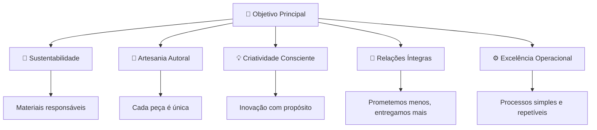
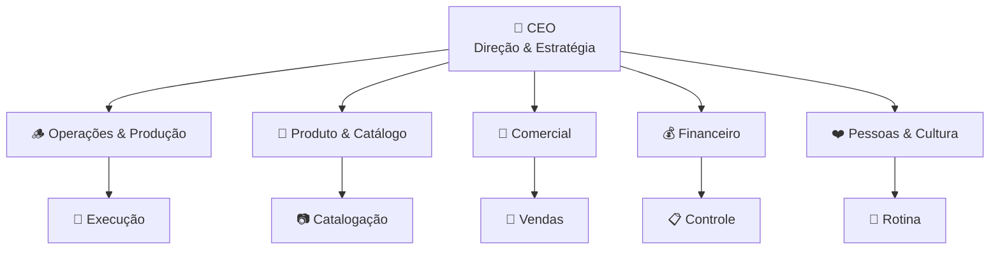
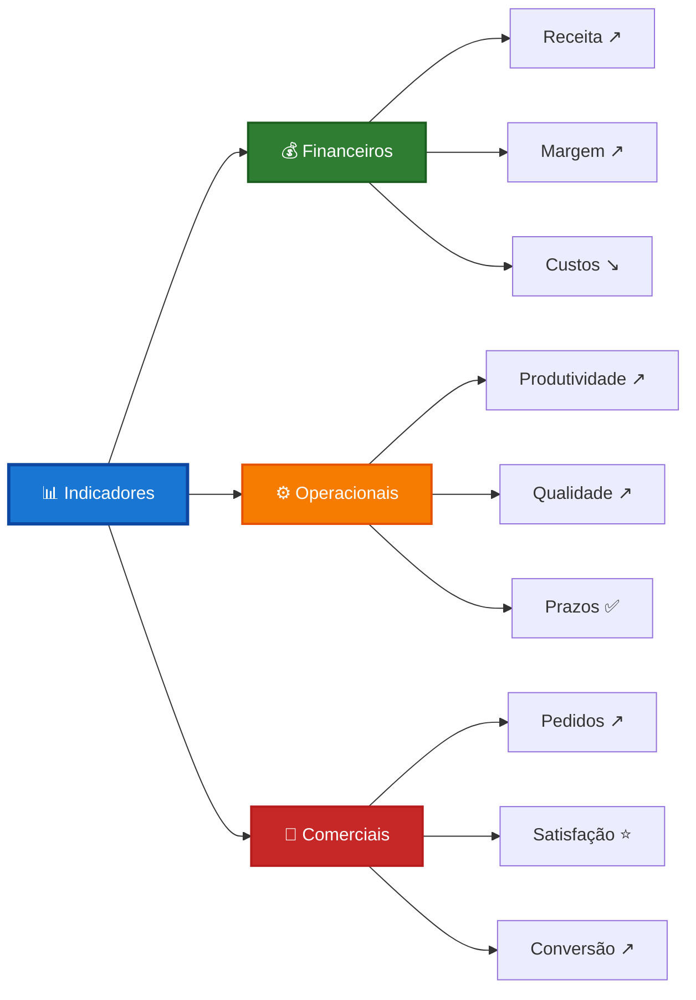

# 📊 Painel — Visão Consolidada da Empresa

> **O coração do sistema**: centralize os fundamentos da sua empresa e tenha visibilidade completa do que importa.

<div style="text-align: center; margin: 1.5rem 0;">
  <a href="../painel-demo/" style="display: inline-flex; align-items: center; gap: 0.5rem; padding: 0.875rem 2rem; background: linear-gradient(135deg, #009688, #00796b); color: white; border-radius: 10px; font-size: 1.1rem; font-weight: 700; text-decoration: none; box-shadow: 0 4px 15px rgba(0,150,136,0.3); transition: all 0.3s ease;">
    🖥️ Ver Demo Interativo do Painel
  </a>
</div>

---

## 💡 O Que É o Painel?

O **Painel** é sua página inicial autenticada — o lugar onde você vê **tudo que define sua empresa** em um único lugar:

- 🎯 **Objetivo Principal** — Para onde a empresa está indo
- 🏛️ **Pilares** — O que sustenta suas decisões
- 🏗️ **Estrutura** — Quem faz o quê
- 📊 **Indicadores** — Como está o desempenho
- 🔄 **Rituais Pendentes** — O que precisa ser feito
- ✅ **Conquistas Recentes** — O que já foi alcançado

!!! tip "Por que o Painel é importante?"
    Sem centralização, informações ficam espalhadas em conversas, anotações e memória. O Painel garante que **nada se perde** e que você sempre sabe onde está.

---

## 🎯 Seção 1: Objetivo Principal

### O Que É?

A **razão de existir** da sua empresa. Uma frase clara que responde: **"Por que fazemos o que fazemos?"**

<div class="benefits-header">🎁 Benefícios de Ter um Objetivo Claro</div>

| Benefício | Como Funciona |
|-----------|---------------|
| **🧭 Direção única** | Todos sabem para onde remar — reduz dispersão |
| **⚡ Decisões mais rápidas** | Quando surge dúvida, o objetivo é o critério de desempate |
| **💪 Motivação consistente** | Lembra o propósito nos dias difíceis |
| **📏 Filtro de oportunidades** | Ajuda a dizer "não" para o que não alinha |

### Exemplo Prático

=== "Objetivo Bem Definido"
    > **"Criar objetos artesanais que unem natureza, propósito e estética — valorizando o trabalho manual, a sustentabilidade e o impacto positivo."**
    
    ✅ Claro, específico e inspirador  
    ✅ Guia decisões sobre materiais, processos e produtos  
    ✅ Comunica valores para clientes e equipe
    
    **Exemplo real:** Empresa de produtos artísticos (Kuripes, esculturas, caixas) que combina técnicas ancestrais e modernas, focada em xamânicos, espiritualistas e turistas conscientes.

=== "Objetivo Vago"
    > "Ser a melhor empresa do mercado."
    
    ❌ Genérico demais  
    ❌ Não ajuda em decisões práticas  
    ❌ Não inspira nem diferencia

### Como Usar no Dia a Dia

!!! example "Situação: Surge uma oportunidade de vender produtos de plástico"
    **Pergunta:** Isso alinha com nosso objetivo?  
    **Resposta:** Não — nosso objetivo fala em "natureza" e "sustentabilidade"  
    **Decisão:** Recusar a oportunidade

!!! example "Situação real: Cliente pede produtos em madeira não-certificada mais barata"
    **Pergunta:** Isso alinha com sustentabilidade e qualidade?  
    **Resposta:** Não — sacrificaria pilares essenciais  
    **Decisão:** Manter materiais responsáveis, explicar diferencial ao cliente

---

## 🏛️ Seção 2: Pilares da Empresa

### O Que São?

Os **3 a 5 fundamentos** que sustentam tudo que você faz. São os valores e princípios não-negociáveis.

<div class="benefits-header">🎁 Benefícios de Ter Pilares Definidos</div>

| Benefício | Como Funciona |
|-----------|---------------|
| **🎯 Coerência** | Decisões alinhadas com identidade da empresa |
| **🛡️ Proteção contra desvios** | Evita aceitar projetos ou clientes que não combinam |
| **🤝 Cultura forte** | Equipe sabe o que é valorizado e esperado |
| **📣 Comunicação clara** | Clientes entendem o que você representa |

### Exemplo Prático



### Como Usar no Dia a Dia

!!! example "Situação: Cliente pede prazo impossível"
    **Pilar envolvido:** Relações Íntegras  
    **Princípio:** "Prometemos menos, entregamos mais"  
    **Decisão:** Negociar prazo realista ou recusar

---

## 🏗️ Seção 3: Estrutura e Responsáveis

### O Que É?

A **organização da empresa** em setores, com papéis e responsabilidades claras.

<div class="benefits-header">🎁 Benefícios de Ter Estrutura Definida</div>

| Benefício | Como Funciona |
|-----------|---------------|
| **🎯 Clareza de responsabilidade** | Ninguém fica sem saber quem cuida do quê |
| **⚡ Agilidade** | Problemas vão direto para quem pode resolver |
| **🚫 Evita sobrecarga** | Distribuição equilibrada de tarefas |
| **📈 Escalabilidade** | Facilita crescimento organizado |
| **🔍 Rastreabilidade** | Sabe quem decidiu e executou cada coisa |

### Visualização da Estrutura

=== "Visão por Níveis"
    | Nível | Função | Benefício |
    |-------|--------|-----------|
    | **🌿 Estratégico** | Visão, identidade, metas anuais | Define **para onde** ir |
    | **🪵 Tático** | Transforma visão em planos por área | Define **como** chegar |
    | **🛠️ Gerencial** | Supervisão diária, qualidade | Garante **execução** |
    | **🔨 Operacional** | Execução, atendimento, logística | **Faz acontecer** |

=== "Visão por Setores"
    | Setor | Responsabilidades | Exemplo Prático | Por Que Importa |
    |-------|-------------------|-----------------|-----------------|
    | **🪵 Operações & Produção** | Lotes, materiais, prazos | Lixamento, acabamento, goma laca | Garante que produtos sejam feitos |
    | **🎨 Produto & Catálogo** | Novos modelos, fotos, preços | Novos kuripes, caixas, esculturas | Mantém oferta atualizada e atrativa |
    | **🛒 Comercial** | Atendimento, envios, feiras | Etsy, ML, Feiras, atacado | Gera receita e relacionamento |
    | **💰 Financeiro** | Entradas, saídas, custos | Metas 15k → 20k/mês | Mantém empresa saudável |
    | **❤️ Pessoas & Cultura** | Ritmo, segurança, alinhamento | Evitar lesão, contratar auxiliar | Cuida de quem faz tudo acontecer |

### Organograma Interativo



### Como Usar no Dia a Dia

!!! example "Situação: Cliente reclama de atraso na entrega"
    **Estrutura ajuda:**  
    1. Identifica responsável: Setor Comercial (envios)  
    2. Investiga causa: Pode ser problema na Produção (atraso) ou Comercial (comunicação)  
    3. Resolve com clareza: Cada setor sabe sua parte

---

## 📊 Seção 4: Indicadores Principais

### O Que São?

**Métricas** que mostram se a empresa está saudável e evoluindo.

<div class="benefits-header">🎁 Benefícios de Acompanhar Indicadores</div>

| Benefício | Como Funciona |
|-----------|---------------|
| **📈 Visibilidade real** | Sai do "achismo" e vai para dados concretos |
| **🚨 Alerta precoce** | Detecta problemas antes de virarem crises |
| **🎯 Foco no que importa** | Prioriza o que realmente move a empresa |
| **📊 Decisões informadas** | Baseia escolhas em evidências, não intuição |
| **🏆 Celebra conquistas** | Reconhece progresso e motiva equipe |

### Indicadores Essenciais

=== "Financeiros"
    | Indicador | O Que Mede | Benefício |
    |-----------|------------|-----------|
    | **💰 Receita Mensal** | Quanto entra | Sustentabilidade básica |
    | **💸 Margem de Lucro** | Quanto sobra | Saúde financeira |
    | **📉 Custo por Produto** | Eficiência produtiva | Precificação correta |
    | **💵 Fluxo de Caixa** | Dinheiro disponível | Evita apertos |

=== "Operacionais"
    | Indicador | O Que Mede | Benefício |
    |-----------|------------|-----------|
    | **⏱️ Tempo de Produção** | Eficiência | Cumprir prazos |
    | **✅ Taxa de Qualidade** | Produtos aprovados | Menos retrabalho |
    | **📦 Pedidos Entregues** | Confiabilidade | Satisfação do cliente |
    | **🔄 Taxa de Retrabalho** | Erros | Melhoria contínua |

=== "Comerciais"
    | Indicador | O Que Mede | Benefício |
    |-----------|------------|-----------|
    | **🛒 Pedidos/Mês** | Demanda | Crescimento |
    | **⭐ NPS (Satisfação)** | Felicidade do cliente | Reputação |
    | **🔁 Taxa de Retorno** | Fidelização | Receita recorrente |
    | **📱 Taxa de Conversão** | Eficiência de vendas | Otimização |

### Visualização de Indicadores



### Como Usar no Dia a Dia

!!! example "Situação: Margem de lucro caindo há 2 meses"
    **Indicador alerta:**  
    1. Investiga causas: Custos subindo? Preços defasados?  
    2. Toma decisão: Renegocia fornecedores ou ajusta preços  
    3. Monitora resultado: Margem volta a subir?

---

## 🔄 Seção 5: Rituais Pendentes

### O Que São?

**Gatilhos visuais** que mostram quais rituais precisam ser realizados.

<div class="benefits-header">🎁 Benefícios de Acompanhar Rituais</div>

| Benefício | Como Funciona |
|-----------|---------------|
| **📅 Disciplina** | Cria rotina de revisão e planejamento |
| **🔄 Continuidade** | Nada fica esquecido ou atrasado |
| **⚡ Proatividade** | Sistema avisa antes de virar problema |
| **📊 Visibilidade** | Sabe exatamente o que está pendente |

### Visualização de Rituais

| Ritual | Frequência | Última Realização | Status | Ação |
|--------|------------|-------------------|--------|------|
| **🗓️ Trimestral** | A cada 90 dias | Há 85 dias | 🟡 Próximo em 5 dias | [Iniciar Ritual](rituais/trimestral.md) |
| **📅 Mensal** | A cada 30 dias | Há 32 dias | 🔴 Atrasado 2 dias | [Iniciar Ritual](rituais/mensal.md) |
| **📆 Semanal** | A cada 7 dias | Há 6 dias | 🟢 No prazo | [Iniciar Ritual](rituais/semanal.md) |
| **☀️ Diário** | Todo dia útil | Ontem | 🟢 Em dia | [Iniciar Ritual](rituais/diario.md) |

### Como Usar no Dia a Dia

!!! example "Situação: Painel mostra ritual mensal atrasado"
    **Sistema ajuda:**  
    1. Alerta visual (🔴)  
    2. Mostra quantos dias de atraso  
    3. Botão direto para iniciar  
    4. Retoma continuidade

---

## ✅ Seção 6: Conquistas Recentes

### O Que São?

**Itens concluídos** nos últimos 7 dias — decisões tomadas, problemas resolvidos, prioridades finalizadas.

<div class="benefits-header">🎁 Benefícios de Visualizar Conquistas</div>

| Benefício | Como Funciona |
|-----------|---------------|
| **🎉 Motivação** | Mostra progresso tangível |
| **📊 Senso de avanço** | Combate sensação de "não sair do lugar" |
| **🏆 Reconhecimento** | Celebra esforço da equipe |
| **📈 Histórico** | Documenta evolução da empresa |

### Visualização de Conquistas

=== "Últimos 7 Dias"
    | Tipo | Item | Responsável | Data |
    |------|------|-------------|------|
    | ✅ **Decisão** | Adotar madeira certificada FSC | CEO | Ontem |
    | ✅ **Prioridade** | Fotografar 20 novos produtos | Produto | Há 2 dias |
    | ✅ **Problema** | Resolver atraso com fornecedor | Operações | Há 3 dias |
    | ✅ **Ação** | Atualizar preços no site | Comercial | Há 5 dias |

=== "Últimos 30 Dias"
    ```mermaid
    pie title Conquistas por Tipo (Último Mês)
        "Decisões" : 12
        "Prioridades" : 25
        "Problemas Resolvidos" : 8
        "Ações Concluídas" : 35
    ```

### Como Usar no Dia a Dia

!!! example "Situação: Equipe desmotivada, sensação de não avançar"
    **Conquistas ajudam:**  
    1. Mostra 35 ações concluídas no mês  
    2. Destaca 8 problemas resolvidos  
    3. Celebra progresso real  
    4. Renova energia

---

## 🎯 Como Usar o Painel Efetivamente

### Rotina Recomendada

| Momento | Ação | Benefício |
|---------|------|-----------|
| **🌅 Início do dia** | Abrir Painel, ver rituais pendentes | Sabe o que fazer |
| **☀️ Durante o dia** | Consultar estrutura quando surgir dúvida | Clareza de responsabilidade |
| **🌆 Fim do dia** | Atualizar conquistas | Senso de progresso |
| **📅 Início da semana** | Revisar indicadores | Ajusta foco |
| **🗓️ Início do mês** | Fazer ritual mensal | Mantém alinhamento |

### Checklist de Manutenção

??? tip "Manutenção Semanal do Painel"
    - [ ] Atualizar indicadores principais
    - [ ] Marcar rituais realizados
    - [ ] Revisar conquistas da semana
    - [ ] Verificar se estrutura está atualizada

??? tip "Manutenção Mensal do Painel"
    - [ ] Revisar objetivo principal (ainda faz sentido?)
    - [ ] Validar pilares (estão sendo seguidos?)
    - [ ] Atualizar responsáveis (mudanças na equipe?)
    - [ ] Ajustar indicadores (métricas ainda relevantes?)

??? tip "Manutenção Trimestral do Painel"
    - [ ] Fazer ritual trimestral completo
    - [ ] Revisar estrutura organizacional
    - [ ] Avaliar se pilares precisam ajuste
    - [ ] Definir novos indicadores se necessário

---

## 🚀 Próximos Passos

Agora que você entende o Painel, siga esta sequência:

1. **[Configure Seu Primeiro Painel](rituais/trimestral.md)** — Faça o ritual trimestral
2. **[Entenda os Rituais](rituais/index.md)** — Aprenda como manter o Painel atualizado
3. **[Use o Quadro](quadro.md)** — Gerencie ideias, problemas e prioridades
4. **[Defina Indicadores](indicadores.md)** — Escolha métricas que importam

---

## ❓ Perguntas Frequentes

??? question "Com que frequência devo atualizar o Painel?"
    - **Indicadores**: Semanalmente
    - **Rituais**: Conforme cadência (diário, semanal, mensal, trimestral)
    - **Conquistas**: Diariamente (ao concluir itens)
    - **Estrutura**: Trimestralmente ou quando houver mudanças

??? question "O Painel substitui outras ferramentas?"
    Não. O Painel é a **visão consolidada**. Você ainda pode usar:


    - Planilhas para detalhes financeiros
    - Kanban para tarefas operacionais
    - Calendário para compromissos
    
    O Painel **centraliza o essencial**, não substitui ferramentas específicas.

??? question "E se minha empresa for muito pequena?"
    Mesmo empresas de 1 pessoa se beneficiam! Adapte:


    - Estrutura: Você pode ocupar todos os papéis (mas liste-os)
    - Indicadores: Comece com 3-5 métricas básicas
    - Rituais: Mantenha pelo menos semanal e mensal

??? question "Como evitar que o Painel fique desatualizado?"
    - **Vincule aos rituais**: Atualização vira parte da rotina
    - **Mantenha simples**: Menos informação, mais fácil manter
    - **Automatize o possível**: Indicadores que se atualizam sozinhos
    - **Crie hábito**: Abra o Painel todo dia

---

<p align="center">
  <strong>Painel</strong> — O coração do seu sistema de gestão 📊
</p>
