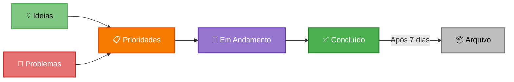

# 📋 Modelo 1: Quadro Único Unificado

> **Tudo em um lugar**: Fundamentos estratégicos + Gestão operacional em um único Kanban.

**[← Voltar para visão geral](quadro.md)** | **[Evoluir para Modelo 2 →](quadro-modelo-2.md)**

---

## 💡 O Que É o Modelo 1?

O **Modelo 1** é um quadro Kanban único que **unifica Painel + Quadro** em um só lugar. Ele possui:

- **1 coluna fixa** com cartões estratégicos (nunca movem)
- **5 colunas de fluxo** para gestão operacional

**Resultado:** Você não precisa de Painel separado. Tudo está aqui.

---

## 🎯 Estrutura do Quadro

### Colunas

| Coluna | Tipo | O Que Entra | Move? |
|--------|------|-------------|-------|
| **🎯 Decisões Estratégicas** | 🔒 FIXA | Cartões fixos indispensáveis | ❌ Nunca |
| **💡 Ideias** | Fluxo | Sugestões, oportunidades | ✅ Sim |
| **🚨 Problemas** | Fluxo | Falhas, riscos, bloqueios | ✅ Sim |
| **📋 Prioridades** | Fluxo | O que PRECISA ser feito | ✅ Sim |
| **🔄 Em Andamento** | Fluxo | Ações sendo executadas | ✅ Sim |
| **✅ Concluído (7 dias)** | Fluxo | Finalizados recentemente | ✅ Arquiva após 7 dias |

### Fluxo Visual



---

## 🔒 Coluna Fixa: Decisões Estratégicas

Esta coluna é **especial**. Os cartões aqui são **permanentes** e representam os fundamentos da empresa.

!!! warning "Regra de Ouro"
    Cartões da coluna **🎯 Decisões Estratégicas**:
    


    - ❌ Nunca são movidos
    - ❌ Nunca são arquivados
    - ✅ São atualizados nos rituais
    - ✅ Sempre visíveis

---

## 📑 Templates de Cartões Fixos

Abaixo estão **TODOS os cartões fixos possíveis**. Escolha os que fazem sentido para sua empresa.

### ✅ Cartões Essenciais (Mínimo Recomendado)

Estes 6 cartões são **indispensáveis** para gerenciar qualquer empresa:

#### 1. 🎯 Meta Trimestral

**O que é:** Objetivo principal dos próximos 90 dias

**Template:**
```markdown
Título: 🎯 Meta Trimestral Q[X]/[ANO]

Descrição:
**Período:** [Data Início] - [Data Fim]

**Objetivo Principal:**
[Descreva em 1-2 frases o que quer alcançar neste trimestre]

**Prioridades Estratégicas:**
1. [Prioridade 1]
2. [Prioridade 2]
3. [Prioridade 3]
4. [Prioridade 4]
5. [Prioridade 5]

**Status:** 🟢 No prazo | 🟡 Atenção | 🔴 Atrasado

**Última atualização:** [Data]
**Próxima revisão:** [Data do próximo Ritual Trimestral]
```

**Atualizado em:** Ritual Trimestral  
**Exemplo real:**
> 🎯 Meta Trimestral Q2/2026  
> Estruturar organização e crescer de 15k → 20k/mês

---

#### 2. 📊 Indicadores Principais

**O que é:** 5-7 métricas essenciais com valores atuais

**Template:**
```markdown
Título: 📊 Indicadores Principais

Descrição:
**Atualizado em:** [Data]

Indicador 1: [Nome do indicador]
Meta: [Valor meta]
Atual: [Valor atual]
Tendência: ↗️ / → / ↘️
Status: 🟢 / 🟡 / 🔴

Indicador 2: [Nome do indicador]
Meta: [Valor meta]
Atual: [Valor atual]
Tendência: ↗️ / → / ↘️
Status: 🟢 / 🟡 / 🔴

Indicador 3: [Nome do indicador]
Meta: [Valor meta]
Atual: [Valor atual]
Tendência: ↗️ / → / ↘️
Status: 🟢 / 🟡 / 🔴

Indicador 4: [Nome do indicador]
Meta: [Valor meta]
Atual: [Valor atual]
Tendência: ↗️ / → / ↘️
Status: 🟢 / 🟡 / 🔴

Indicador 5: [Nome do indicador]
Meta: [Valor meta]
Atual: [Valor atual]
Tendência: ↗️ / → / ↘️
Status: 🟢 / 🟡 / 🔴

---
Legenda:

🟢 Saudável (meta atingida ou superada)
🟡 Atenção (próximo da meta, precisa acompanhar)
🔴 Crítico (abaixo da meta, exige ação)

Tendência:
↗️ Subindo = melhorando com o tempo
→ Estável = sem variação significativa
↘️ Caindo = piorando, investigar causa

Como preencher:
- Meta = onde você quer chegar
- Atual = onde está agora
- Se Atual ≥ Meta → 🟢
- Se Atual está perto da Meta (80-99%) → 🟡
- Se Atual está longe da Meta (<80%) → 🔴

Indicadores que mudaram de status este mês:
[Liste aqui se houver mudança de 🟢→🟡, 🟡→🔴, etc.]

Próxima atualização: [Data do próximo Ritual Mensal]
```

**Atualizado em:** Ritual Mensal  
**Exemplo real:**
> Receita Mensal: Meta 20k | Atual 15k | ↗️ | 🟢

---

#### 3. 🏛️ Pilares da Empresa

**O que é:** 3-5 valores/princípios inegociáveis

**Template:**
```markdown
Título: 🏛️ Pilares da Empresa

Descrição:
**Valores Fundamentais:**

1. **[Nome do Pilar 1]**
   - O que significa: [Explicação]
   - Como se manifesta: [Exemplos práticos]

2. **[Nome do Pilar 2]**
   - O que significa: [Explicação]
   - Como se manifesta: [Exemplos práticos]

3. **[Nome do Pilar 3]**
   - O que significa: [Explicação]
   - Como se manifesta: [Exemplos práticos]

4. **[Nome do Pilar 4]** (opcional)
   - O que significa: [Explicação]
   - Como se manifesta: [Exemplos práticos]

5. **[Nome do Pilar 5]** (opcional)
   - O que significa: [Explicação]
   - Como se manifesta: [Exemplos práticos]

**Última revisão:** [Data]
```

**Atualizado em:** Ritual Trimestral  
**Exemplo real:**
> 🌱 Sustentabilidade | 🎨 Inovação | 💎 Qualidade

---

#### 4. 📈 Status do Trimestre

**O que é:** Progresso atual vs objetivo trimestral

**Template:**
```markdown
Título: 📈 Status do Trimestre Q[X]/[ANO]

Descrição:
**Progresso Geral:** [XX]% concluído

**Por Prioridade:**

1. ✅ [Prioridade 1]: [Status] - [% concluído]
2. 🟡 [Prioridade 2]: [Status] - [% concluído]
3. 🔴 [Prioridade 3]: [Status] - [% concluído]
4. ⏳ [Prioridade 4]: [Status] - [% concluído]
5. ⏳ [Prioridade 5]: [Status] - [% concluído]

**Destaques do Mês:**
- [Conquista ou avanço significativo]
- [Conquista ou avanço significativo]

**Atenção:**
- [Ponto de atenção ou risco]
- [Ponto de atenção ou risco]

**Próximos Passos:**
- [O que fazer no próximo mês]

**Atualizado em:** [Data]
```

**Atualizado em:** Ritual Mensal  
**Exemplo real:**
> Progresso: 45% | ML cresceu 125% | Instagram com 200 seguidores

---

#### 5. ⚠️ Riscos Monitorados

**O que é:** 3-5 maiores riscos e seu status

**Template:**
```markdown
Título: ⚠️ Riscos Monitorados

Descrição:
**Atualizado em:** [Data]

Risco 1: [Descreva o risco]
Probabilidade: Alta / Média / Baixa
Impacto: Alto / Médio / Baixo
Status: 🔴 / 🟡 / 🟢
Plano: [Ação preventiva ou de contenção]

Risco 2: [Descreva o risco]
Probabilidade: Alta / Média / Baixa
Impacto: Alto / Médio / Baixo
Status: 🔴 / 🟡 / 🟢
Plano: [Ação preventiva ou de contenção]

Risco 3: [Descreva o risco]
Probabilidade: Alta / Média / Baixa
Impacto: Alto / Médio / Baixo
Status: 🔴 / 🟡 / 🟢
Plano: [Ação preventiva ou de contenção]

Risco 4: [Descreva o risco]
Probabilidade: Alta / Média / Baixa
Impacto: Alto / Médio / Baixo
Status: 🔴 / 🟡 / 🟢
Plano: [Ação preventiva ou de contenção]

Risco 5: [Descreva o risco]
Probabilidade: Alta / Média / Baixa
Impacto: Alto / Médio / Baixo
Status: 🔴 / 🟡 / 🟢
Plano: [Ação preventiva ou de contenção]

---
Legenda:

🔴 Crítico (alta prioridade, exige ação imediata)
🟡 Monitorar (atenção, acompanhar de perto)
🟢 Controlado (baixo risco, sem ação urgente)

Probabilidade:
Alta = muito provável de acontecer
Média = pode acontecer, depende de fatores
Baixa = improvável, mas possível

Impacto:
Alto = atrasa ou trava algo importante
Médio = incomoda, mas dá para contornar
Baixo = efeito pequeno, sem grande dano

Como definir o Status:
- Probabilidade Alta + Impacto Alto → 🔴
- Probabilidade ou Impacto Médio → 🟡
- Ambos Baixos → 🟢

Riscos que se concretizaram este mês:
[Se houver, liste aqui com o que foi feito]

Novos riscos identificados:
[Se houver, liste aqui]

Próxima revisão: [Data do próximo Ritual Mensal]
```

**Atualizado em:** Ritual Mensal (revisão) + Ritual Trimestral (definição inicial)  
**Exemplo real:**
> Taxa EUA: Alta prob. | Alto impacto | 🟡 Monitorando

---

#### 6. 🏆 Conquistas do Mês

**O que é:** Principais vitórias e celebrações recentes

**Template:**
```markdown
Título: 🏆 Conquistas do Mês [MÊS/ANO]

Descrição:
**Grandes Vitórias:**

1. 🎉 [Conquista significativa]
   - Impacto: [Como isso ajuda a empresa]
   
2. 🎉 [Conquista significativa]
   - Impacto: [Como isso ajuda a empresa]

3. 🎉 [Conquista significativa]
   - Impacto: [Como isso ajuda a empresa]

**Pequenas Vitórias:**
- ✅ [Conquista menor mas importante]
- ✅ [Conquista menor mas importante]
- ✅ [Conquista menor mas importante]

**Pessoas Destaque:**
- 🌟 [Nome]: [Contribuição]
- 🌟 [Nome]: [Contribuição]

**Métricas Positivas:**
- 📈 [Indicador que melhorou]
- 📈 [Indicador que melhorou]

**Última atualização:** [Data]
```

**Atualizado em:** Ritual Mensal  
**Exemplo real:**
> ML cresceu 125% | Goma Laca adotada | Auxiliar contratado

---

### 📌 Cartões Opcionais (Escolha os Relevantes)

Adicione estes cartões conforme sua empresa amadurece:

#### 7. 🎯 Objetivo Principal

**O que é:** Propósito fundamental da empresa (longo prazo)

**Template:**
```markdown
Título: 🎯 Objetivo Principal

Descrição:
**Propósito da Empresa:**
[Por que esta empresa existe?]

**Para Quem:**
[Quem são os clientes ideais?]

**Diferencial:**
[O que nos torna únicos?]

**Visão de Longo Prazo (3-5 anos):**
[Onde queremos chegar?]

**Última revisão:** [Data]
**Próxima revisão:** [Data (anual)]
```

**Atualizado em:** Ritual Trimestral (ou anual)

---

#### 8. 📐 Canvas Simplificado

**O que é:** Modelo de negócio em 1 página

**Template:**
```markdown
Título: 📐 Canvas Simplificado

Descrição:
**Segmentos de Clientes:**
- [Quem são]

**Proposta de Valor:**
- [O que oferecemos]

**Canais:**
- [Como alcançamos clientes]

**Relacionamento:**
- [Como nos relacionamos]

**Receitas:**


- [Como ganhamos dinheiro]


**Recursos-Chave:**
- [O que é essencial]


**Atividades-Chave:**


- [O que fazemos]

**Parcerias-Chave:**
- [Com quem contamos]

**Custos:**
- [Principais gastos]

**Última atualização:** [Data]
```

**Atualizado em:** Ritual Trimestral

---

#### 9. 👥 Estrutura e Responsáveis

**O que é:** Organograma e papéis principais

**Template:**
```markdown
Título: 👥 Estrutura e Responsáveis

Descrição:
**Organização:**

**Nível Estratégico:**
- 👔 CEO/Fundador: [Nome]

**Nível Tático:**
- 🪵 Produção: [Nome]
- 🎨 Produto: [Nome]
- 🛒 Comercial: [Nome]
- 💰 Financeiro: [Nome]
- ❤️ Pessoas: [Nome]

**Nível Operacional:**

- [Função]: [Nome]
- [Função]: [Nome]

**Última atualização:** [Data]
```

**Atualizado em:** Ritual Trimestral

---

#### 10. 🌍 Frentes Estratégicas

**O que é:** 3-5 grandes iniciativas do trimestre

**Template:**
```markdown
Título: 🌍 Frentes Estratégicas Q[X]/[ANO]

Descrição:
**Grandes Iniciativas:**

1. **[Nome da Frente 1]**
   - Objetivo: [O que quer alcançar]
   - Responsável: [Nome]
   - Status: 🔴🟡🟢

2. **[Nome da Frente 2]**
   - Objetivo: [O que quer alcançar]
   - Responsável: [Nome]
   - Status: 🔴🟡🟢

3. **[Nome da Frente 3]**
   - Objetivo: [O que quer alcançar]
   - Responsável: [Nome]
   - Status: 🔴🟡🟢

**Última atualização:** [Data]
```

**Atualizado em:** Ritual Mensal

---

#### 11. 📋 Plano de Ação Trimestral

**O que é:** Ações concretas para atingir meta trimestral

**Template:**
```markdown
Título: 📋 Plano de Ação Q[X]/[ANO]

Descrição:
**Ações Prioritárias:**

**Mês 1:**
- [ ] [Ação 1] - [Responsável]
- [ ] [Ação 2] - [Responsável]
- [ ] [Ação 3] - [Responsável]

**Mês 2:**
- [ ] [Ação 1] - [Responsável]
- [ ] [Ação 2] - [Responsável]
- [ ] [Ação 3] - [Responsável]

**Mês 3:**
- [ ] [Ação 1] - [Responsável]
- [ ] [Ação 2] - [Responsável]
- [ ] [Ação 3] - [Responsável]

**Última atualização:** [Data]
```

**Atualizado em:** Ritual Mensal

---

#### 12. 💡 Aprendizados do Trimestre

**O que é:** Lições importantes do trimestre anterior

**Template:**
```markdown
Título: 💡 Aprendizados Q[X]/[ANO]

Descrição:
**O que funcionou:**
- ✅ [Aprendizado positivo]
- ✅ [Aprendizado positivo]
- ✅ [Aprendizado positivo]

**O que não funcionou:**
- ❌ [Aprendizado de erro]
- ❌ [Aprendizado de erro]
- ❌ [Aprendizado de erro]

**Insights Importantes:**
- 💡 [Insight sobre mercado/cliente]
- 💡 [Insight sobre produto/operação]
- 💡 [Insight sobre time/cultura]

**O que mudar no próximo trimestre:**
- 🔄 [Mudança necessária]
- 🔄 [Mudança necessária]

**Registrado em:** [Data]
```

**Atualizado em:** Ritual Trimestral

---

#### 13. 🎓 Decisões Importantes

**O que é:** Registro de decisões estratégicas tomadas


**Template:**
```markdown
Título: 🎓 Decisões Importantes

Descrição:
**Histórico de Decisões:**

**[Data] - [Título da Decisão]**
- Contexto: [Por que decidimos]
- Decisão: [O que decidimos]
- Responsável: [Quem executa]
- Impacto esperado: [O que esperamos]

**[Data] - [Título da Decisão]**
- Contexto: [Por que decidimos]
- Decisão: [O que decidimos]
- Responsável: [Quem executa]
- Impacto esperado: [O que esperamos]

**Última atualização:** [Data]
```

**Atualizado em:** Sempre que houver decisão estratégica

---

#### 14. 📈 OKRs do Trimestre


**O que é:** Objectives and Key Results (se usar OKR)


**Template:**


```markdown
Título: 📈 OKRs Q[X]/[ANO]

Descrição:
**Objetivo 1:** [Nome do objetivo]
- KR1: [Resultado-chave 1] - [Meta] - [Atual] - [%]
- KR2: [Resultado-chave 2] - [Meta] - [Atual] - [%]
- KR3: [Resultado-chave 3] - [Meta] - [Atual] - [%]

**Objetivo 2:** [Nome do objetivo]
- KR1: [Resultado-chave 1] - [Meta] - [Atual] - [%]
- KR2: [Resultado-chave 2] - [Meta] - [Atual] - [%]
- KR3: [Resultado-chave 3] - [Meta] - [Atual] - [%]

**Objetivo 3:** [Nome do objetivo]
- KR1: [Resultado-chave 1] - [Meta] - [Atual] - [%]
- KR2: [Resultado-chave 2] - [Meta] - [Atual] - [%]

**Última atualização:** [Data]
```

**Atualizado em:** Ritual Mensal

---

#### 15. 💰 Orçamento Trimestral

**O que é:** Previsão financeira do trimestre


**Template:**
```markdown
Título: 💰 Orçamento Q[X]/[ANO]


Descrição:
**Receitas Previstas:**
- Total: R$ [Valor]
- Por mês: R$ [M1] | R$ [M2] | R$ [M3]


**Custos Previstos:**
- Total: R$ [Valor]
- Por categoria:
  - Produção: R$ [Valor]
  - Pessoas: R$ [Valor]
  - Marketing: R$ [Valor]
  - Operacional: R$ [Valor]

**Resultado Esperado:**
- Lucro: R$ [Valor]
- Margem: [%]

**Real vs Previsto:**
- Receita: [Realizado] vs [Previsto] = [Variação%]
- Custos: [Realizado] vs [Previsto] = [Variação%]

**Última atualização:** [Data]
```

**Atualizado em:** Ritual Mensal

---

## 🎯 Recomendação de Uso

### Configuração Mínima (Iniciantes)

**Use apenas os 6 cartões essenciais:**
1. 🎯 Meta Trimestral
2. 📊 Indicadores Principais
3. 🏛️ Pilares da Empresa
4. 📈 Status do Trimestre
5. ⚠️ Riscos Monitorados
6. 🏆 Conquistas do Mês

**Tempo para configurar:** 2-3 horas

---

### Configuração Intermediária (Crescendo)

**Adicione 3-4 cartões opcionais:**
- Essenciais (6) +
- 🎯 Objetivo Principal
- 👥 Estrutura e Responsáveis
- 🌍 Frentes Estratégicas
- 💡 Aprendizados

**Tempo para configurar:** 4-5 horas

---

### Configuração Completa (Avançado)

**Use todos os cartões relevantes** para sua empresa.

**Tempo para configurar:** 1 dia

---

## 🏷️ Sistema de Etiquetas

Use **apenas 1 etiqueta colorida** por cartão operacional:

| Cor | Área | Quando Usar |
|-----|------|-------------|
| 🟦 Azul | Produção | Cartões de operações, fabricação |
| 🟩 Verde | Comercial | Cartões de vendas, atendimento |
| 🟨 Amarelo | Financeiro | Cartões de finanças, custos |
| 🟧 Laranja | Produto | Cartões de desenvolvimento |
| 🟪 Roxo | Pessoas | Cartões de RH, cultura |
| 🟥 Vermelho | URGENTE | Só para crises reais |

!!! tip "Cartões fixos não têm etiqueta"
    Os cartões da coluna **🎯 Decisões Estratégicas** não precisam de etiqueta. Eles são identificados pelo emoji prefixo (🎯, 📊, etc.)

---

## 🔄 Como Usar no Dia a Dia

### Ritual Diário (5-10 min)

1. **Consulte** "🎯 Meta Trimestral" — Lembre do foco
2. **Revise** coluna "Em Andamento" — Atualize status
3. **Identifique** bloqueios
4. **Inicie** novas ações prioritárias
5. **Conclua** finalizadas

**Cartões fixos:** Apenas consulta

---

### Ritual Semanal (30 min)

1. **Revise** "📊 Indicadores Principais" — Como estão?
2. **Celebre** coluna "Concluído" — Conquistas
3. **Priorize** coluna "Prioridades" — O que fazer?
4. **Resolva** bloqueios
5. **Arquive** concluídos com +7 dias

**Cartões fixos:** Apenas consulta

---

### Ritual Mensal (1-2h)

1. **Atualize** 4 cartões fixos:
   - 📊 Indicadores Principais → Novos valores
   - 📈 Status do Trimestre → Progresso
   - ⚠️ Riscos Monitorados → Revisão de riscos
   - 🏆 Conquistas do Mês → Vitórias recentes
2. **Triagem** de "Ideias" → Prioridade ou descarta
3. **Revisão** de "Problemas" → Resolve ou prioriza
4. **Limpe** quadro → Arquive antigo

**Cartões fixos:** 4 atualizações

---

### Ritual Trimestral (2-4h)

1. **Atualize** 2 cartões fixos estratégicos:
   - 🎯 Meta Trimestral → Nova meta de 90 dias
   - 🏛️ Pilares da Empresa → Ainda válidos?
2. **Crie** novas prioridades do trimestre
3. **Arquive** tudo que não é mais relevante
4. **Limpe** arquivo antigo (>90 dias)

**Cartões fixos:** 2 atualizações estratégicas

---

## 📝 Exemplo de Cartão Operacional

!!! example "Implementar controle de estoque"
    **Etiqueta:** 🟦 Azul (Produção)
    
    **Título:** Implementar controle de estoque
    
    **Descrição:**
    - **Por que:** Perdendo 15% dos materiais por falta de controle
    - **O que:** Sistema simples de entrada/saída para reduzir perdas <5%
    - **Critério:**
      - [ ] Planilha de controle criada
      - [ ] Processo de registro definido
      - [ ] Equipe treinada
      - [ ] Perdas medidas por 1 mês
    
    **Responsável:** João  
    **Prazo:** 30/04/2026  
    **Coluna:** Prioridades

---

## 📊 Métricas de Saúde do Quadro

### Indicadores

| Métrica | Como Calcular | Meta |
|---------|---------------|------|
| **Taxa de Conclusão** | Concluídos / Planejados | >80% |
| **Tempo Médio** | Dias criação → conclusão | <14 dias |
| **WIP por Pessoa** | Em Andamento / Pessoas | 3-5 |
| **Taxa de Bloqueio** | Bloqueados / Total | <20% |
| **Cartões fixos atualizados** | Atualizados / Total | 100% mensal |

### Sinais de Alerta

🚨 **Quadro com problemas:**

- Cartões fixos desatualizados (>30 dias)
- Cartões operacionais parados >30 dias
- Muitos bloqueios não resolvidos
- Nada sendo concluído
- Coluna "Ideias" >20 cartões

✅ **Quadro saudável:**

- Cartões fixos sempre atualizados
- Fluxo constante de conclusões
- WIP controlado (3-5/pessoa)
- Bloqueios resolvidos rápido
- Estratégia visível

---

## 🚀 Como Implementar

### Passo a Passo

1. **Escolha ferramenta** (Trello, Notion, físico)
2. **Crie as 6 colunas**
3. **Crie os 6 cartões fixos essenciais** na primeira coluna
4. **Preencha** informações básicas dos cartões
5. **Defina** 6 cores de etiquetas
6. **Migre** cartões do ritual trimestral (se houver)
7. **Treine** equipe (30 min)
8. **Comece** a usar

**Tempo total:** 2-3 horas

---

### Exemplo Real de Implementação

**Empresa:** Produtos artesanais (Kuripes, Caixas, Esculturas)

**Cartões fixos criados:**
1. 🎯 Meta Q2/2026: Estruturar e crescer 15k → 20k/mês
2. 📊 Indicadores: Receita, Pedidos Etsy, Pedidos ML, Novos Produtos
3. 🏛️ Pilares: Sustentabilidade, Inovação, Qualidade
4. 📈 Status: 45% concluído, ML cresceu 125%
5. ⚠️ Riscos: Taxa EUA, Operador lesionado
6. 🏆 Conquistas: Goma Laca adotada, Instagram ativo

**Resultado:** Sistema funcionando em 3 horas

---

## 🔄 Quando Evoluir para Modelo 2?

### Sinais de que precisa evoluir

- ✅ Quadro com >30 cartões operacionais
- ✅ Difícil encontrar informações
- ✅ Estratégia se perde no operacional
- ✅ Equipe >6 pessoas
- ✅ Sente que mistura demais níveis

### Como migrar

**[→ Ver guia de migração para Modelo 2](quadro-modelo-2.md#migrando-do-modelo-1)**

---

## ❓ Perguntas Frequentes

??? question "Quantos cartões fixos devo usar?"
    **Mínimo 6 essenciais. Máximo 10-12.**
    
    Comece com os 6 essenciais:


    1. Meta Trimestral
    2. Indicadores
    3. Pilares
    4. Status
    5. Riscos
    6. Conquistas
    
    Adicione outros conforme necessidade real.

??? question "Cartões fixos ficam na primeira coluna sempre?"
    **Sim! Primeira coluna, sempre visíveis.**
    
    Eles nunca movem. Apenas são atualizados.

??? question "Posso criar meus próprios cartões fixos?"
    **Sim! Mas siga o padrão.**
    
    Use o formato:


    - Emoji prefixo (ex: 🎯)
    - Nome descritivo
    - Template estruturado
    - Frequência de atualização clara

??? question "E se esquecer de atualizar cartões fixos?"
    **Vincule aos rituais obrigatórios.**
    
    - Mensal: 4 cartões (Indicadores, Status, Riscos, Conquistas)
    - Trimestral: 2 cartões (Meta, Pilares)
    - Não pule os rituais!

---

## 📚 Recursos Relacionados

- **[← Voltar para visão geral dos modelos](quadro.md)**
- **[Evoluir para Modelo 2 →](quadro-modelo-2.md)**
- **[Ver Modelo 3 (avançado)](quadro-modelo-3.md)**
- **[Rituais](rituais/index.md)** — Como usar nos rituais
- **[Indicadores](indicadores.md)** — Métricas para cartões fixos

---

<p align="center">
  <strong>Modelo 1</strong> — Comece aqui: Simples, completo e eficaz 📋
</p>
