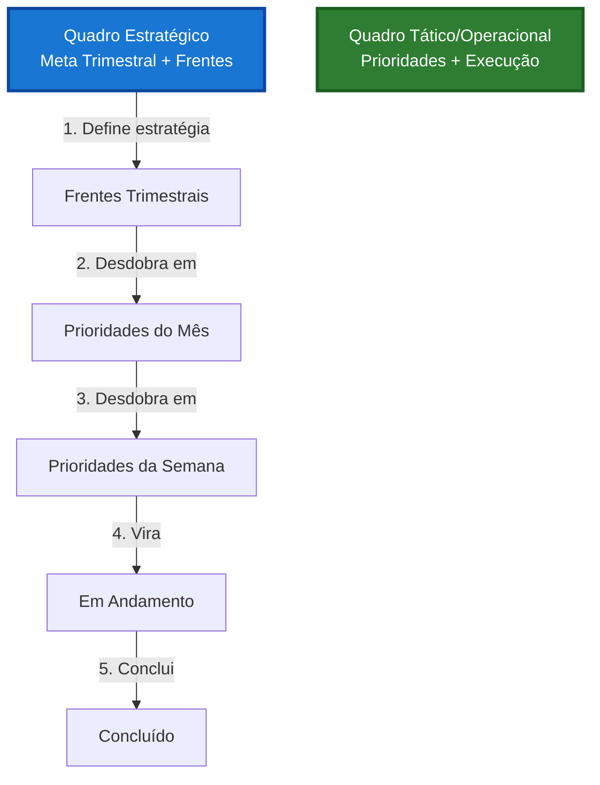
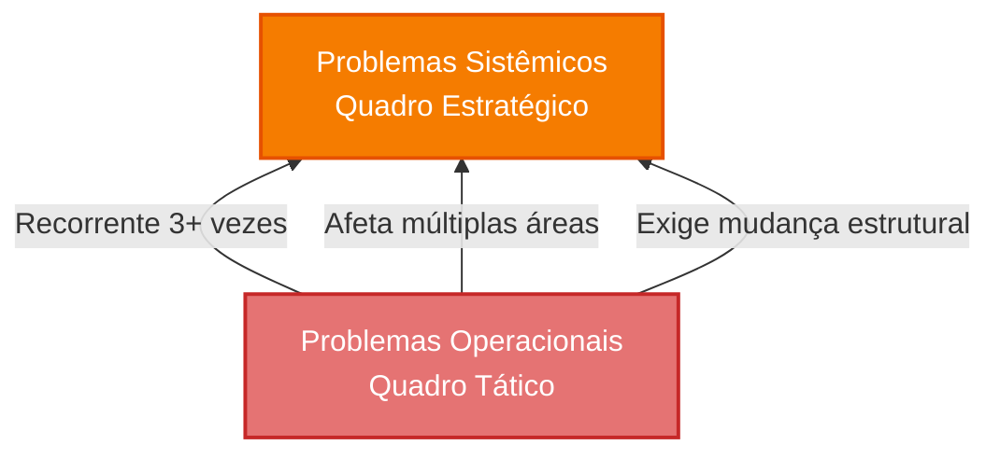

# 📊 Modelo 2: Separação Tática

> **Evolução controlada**: Separa estratégia de operação mantendo sincronização.

**[← Voltar para visão geral](quadro.md)** | **[← Modelo 1](quadro-modelo-1.md)** | **[Modelo 3 →](quadro-modelo-3.md)**

---

## 💡 O Que É o Modelo 2?

O **Modelo 2** separa o quadro único em **dois quadros** independentes mas conectados:

- **Quadro 1: Estratégico** — Fundamentos + Frentes trimestrais
- **Quadro 2: Tático/Operacional** — Prioridades + Execução

**Diferença principal do Modelo 1:** Os cartões fixos estratégicos saem do quadro operacional e ganham um quadro próprio, reduzindo poluição visual.

---

## 🎯 Estrutura Completa

### Quadro 1: Estratégico (Trimestral)

**Quem usa:** CEO, fundadores, lideranças estratégicas

#### Colunas

| Coluna | Tipo | O Que Entra | Move? |
|--------|------|-------------|-------|
| **🎯 Fundamentos** | 🔒 FIXA | Cartões fixos estratégicos (mesmo do Modelo 1) | ❌ Nunca |
| **🏛️ Frentes Trimestrais** | 🔒 FIXA | 3-5 grandes iniciativas do trimestre | Atualiza, não move |
| **💡 Ideias Estratégicas** | Fluxo | Inovações, apostas grandes | ✅ Sim |
| **🚨 Problemas Sistêmicos** | Fluxo | Problemas estruturais | ✅ Sim |
| **✅ Concluído (Trimestre)** | Fluxo | Entregas trimestrais | ✅ Arquiva após trimestre |

#### Cartões Fixos

**Mesmos 6 do Modelo 1** (ou mais, se escolheu cartões opcionais):
1. 🎯 Meta Trimestral
2. 📊 Indicadores Principais
3. 🏛️ Pilares da Empresa
4. 📈 Status do Trimestre
5. ⚠️ Riscos Monitorados
6. 🏆 Conquistas do Mês

**[→ Ver templates de todos cartões fixos](quadro-modelo-1.md#templates-de-cartoes-fixos)**

---

### Quadro 2: Tático/Operacional (Mensal/Semanal)

**Quem usa:** Toda a equipe (coordenadores + executores)

#### Colunas

| Coluna | O Que Entra | Move? |
|--------|-------------|-------|
| **📋 Prioridades do Mês** | Ações táticas derivadas do estratégico | ✅ Sim |
| **💡 Ideias** | Sugestões operacionais, melhorias | ✅ Sim |
| **🚨 Problemas** | Falhas, bloqueios operacionais | ✅ Sim |
| **📋 Prioridades da Semana** | Foco da semana atual | ✅ Sim |
| **🔄 Em Andamento** | Executando agora | ✅ Sim |
| **⏸️ Bloqueado** | Impedimentos | ✅ Sim |
| **✅ Concluído (7 dias)** | Finalizados recentemente | ✅ Arquiva após 7 dias |

---

## 🔄 Relação Entre os Quadros

### Fluxo Descendente (Desdobramento)



### Fluxo Ascendente (Escalonamento)



### Regras de Escalonamento

#### Quando Escalar do Tático → Estratégico?

**Escale quando:**
- ✅ Problema se repete **3+ vezes**
- ✅ Afeta **múltiplas áreas** da empresa
- ✅ Exige **mudança estrutural**
- ✅ Invalida **hipóteses estratégicas**
- ✅ Exige **investimento significativo**

**Como escalar:**
1. Crie cartão no Quadro Estratégico (coluna "Problemas Sistêmicos")
2. Marque origem: "Escalado do Tático"
3. Vincule ao cartão original (link ou referência)
4. Notifique lideranças estratégicas

---

## 🏷️ Sistema de Etiquetas

**Use o mesmo sistema em ambos os quadros:**

| Cor | Área | Aplicação |
|-----|------|-----------|
| 🟦 Azul | Produção | Ambos quadros |
| 🟩 Verde | Comercial | Ambos quadros |
| 🟨 Amarelo | Financeiro | Ambos quadros |
| 🟧 Laranja | Produto | Ambos quadros |
| 🟪 Roxo | Pessoas | Ambos quadros |
| 🟥 Vermelho | URGENTE | Apenas Tático |

!!! tip "Consistência é essencial"
    Use as **mesmas cores** para as **mesmas áreas** em ambos quadros. Isso facilita rastreamento.

---

## 🔄 Como Usar no Dia a Dia

### Ritual Diário (5-10 min)

**Quadro:** Apenas Tático/Operacional

**Ações:**
1. Revise coluna "Em Andamento"
2. Atualize status
3. Identifique bloqueios
4. Inicie novas ações
5. Conclua finalizadas

**Cartões fixos:** Não acessa

---

### Ritual Semanal (30 min)

**Quadro:** Apenas Tático/Operacional

**Ações:**
1. Celebre coluna "Concluído"
2. Priorize coluna "Prioridades da Semana"
3. Resolva bloqueios
4. Arquive concluídos com +7 dias
5. Identifique problemas recorrentes → Escale se necessário

**Cartões fixos:** Não acessa

---

### Ritual Mensal (1-2h)

**Quadros:** **Ambos** (sincronização obrigatória)

**No Quadro Estratégico:**
1. Atualize 4 cartões fixos:
   - 📊 Indicadores Principais
   - 📈 Status do Trimestre
   - ⚠️ Riscos Monitorados
   - 🏆 Conquistas do Mês
2. Revise "Frentes Trimestrais" → Progresso

**No Quadro Tático/Operacional:**
3. Triagem de "Ideias"
4. Revisão de "Problemas" → Resolve ou escala
5. Crie "Prioridades do Mês" baseadas nas Frentes
6. Limpe quadro → Arquive antigo

**Cartões fixos:** 4 atualizações

---

### Ritual Trimestral (2-4h)

**Quadro:** Principalmente Estratégico

**No Quadro Estratégico:**
1. Atualize 2 cartões fixos estratégicos:
   - 🎯 Meta Trimestral
   - 🏛️ Pilares da Empresa
2. Defina novas "Frentes Trimestrais"
3. Arquive concluídos do trimestre anterior

**No Quadro Tático/Operacional:**
4. Limpe tudo que não é mais relevante
5. Crie primeiras "Prioridades do Mês"

**Cartões fixos:** 2 atualizações estratégicas

---

## 🔄 Migrando do Modelo 1

### Pré-requisitos

Antes de migrar, confirme:
- ✅ Modelo 1 está funcionando há pelo menos 1 mês
- ✅ Quadro tem >30 cartões operacionais
- ✅ Equipe domina conceito de cartões fixos
- ✅ Sentindo necessidade real de separar

---

### Passo a Passo da Migração

#### 1. Prepare o Quadro Estratégico

**Tempo:** 30 minutos

1. Crie novo quadro chamado "Estratégico"
2. Crie 5 colunas:
   - 🎯 Fundamentos
   - 🏛️ Frentes Trimestrais
   - 💡 Ideias Estratégicas
   - 🚨 Problemas Sistêmicos
   - ✅ Concluído (Trimestre)

---

#### 2. Mova os Cartões Fixos

**Tempo:** 15 minutos

1. **Copie** (não mova ainda) os 6+ cartões fixos do Modelo 1
2. **Cole** na coluna "🎯 Fundamentos" do Quadro Estratégico
3. Verifique se todos templates estão corretos
4. **Agora sim, delete** do quadro antigo

!!! warning "Não perca informações"
    Copie antes de deletar para garantir que nada se perca.

---

#### 3. Crie Frentes Trimestrais

**Tempo:** 30 minutos

1. Crie coluna "🏛️ Frentes Trimestrais"
2. Identifique 3-5 grandes iniciativas do trimestre
3. Crie 1 cartão para cada frente

**Template de Frente:**
```markdown
Título: [Nome da Frente]

Descrição:
- Objetivo: [O que quer alcançar]
- Responsável: [Nome]
- Prazo: [Data fim]
- Status: 🔴🟡🟢
- Prioridades vinculadas: [Links para prioridades no Tático]
```

---

#### 4. Reorganize o Quadro Tático

**Tempo:** 30 minutos

1. **Renomeie** quadro antigo para "Tático/Operacional"
2. **Delete** a coluna antiga "Decisões Estratégicas" (cartões já estão no Estratégico)
3. **Adicione** coluna "📋 Prioridades do Mês" (no início)
4. **Reorganize** colunas:
   - Prioridades do Mês
   - Ideias
   - Problemas
   - Prioridades da Semana
   - Em Andamento
   - Bloqueado
   - Concluído

---

#### 5. Vincule Quadros

**Tempo:** 15 minutos

1. No Quadro Estratégico, adicione link para Tático no topo
2. No Quadro Tático, adicione link para Estratégico no topo
3. Em cada Frente, adicione links para prioridades relacionadas

---

#### 6. Treine a Equipe

**Tempo:** 1 hora

**Conteúdo do treinamento:**
1. Por que separamos? (reduzir poluição)
2. O que fica onde? (estratégia vs operação)
3. Como acessar cada quadro?
4. Quando escalar problemas?
5. Rituais em cada quadro

**Formato:** Reunião de 30 min + 30 min de prática

---

#### 7. Rode Primeiro Ritual Mensal

**Tempo:** 1-2h

Execute ritual mensal completo para:
- Atualizar cartões fixos no Estratégico
- Sincronizar Frentes → Prioridades
- Validar que funciona

---

### Checklist de Migração

- [ ] Quadro Estratégico criado com 5 colunas
- [ ] Cartões fixos movidos para Estratégico
- [ ] Frentes Trimestrais criadas (3-5)
- [ ] Quadro Tático reorganizado
- [ ] Links entre quadros adicionados
- [ ] Equipe treinada
- [ ] Primeiro ritual mensal executado
- [ ] Sistema funcionando

**Tempo total:** 1 dia de trabalho + 1 semana de adaptação

---

## 📊 Métricas de Saúde

### Para o Quadro Estratégico

| Métrica | Como Calcular | Meta |
|---------|---------------|------|
| **Cartões fixos atualizados** | Atualizados / Total | 100% mensal |
| **Frentes no prazo** | No prazo / Total | >80% |
| **Taxa de escalonamento** | Escalados / Total problemas | <10% |

### Para o Quadro Tático

| Métrica | Como Calcular | Meta |
|---------|---------------|------|
| **Taxa de Conclusão** | Concluídos / Planejados | >80% |
| **Tempo Médio** | Dias criação → conclusão | <14 dias |
| **WIP por Pessoa** | Em Andamento / Pessoas | 3-5 |
| **Taxa de Bloqueio** | Bloqueados / Total | <20% |

---

## ⚠️ Armadilhas Comuns

### 1. Quadros Desconectados

**Problema:** Operação esquece estratégia

**Solução:**
- Ritual mensal obrigatório em AMBOS quadros
- Links visíveis entre quadros
- Frentes sempre atualizadas

---

### 2. Escalonamento Excessivo

**Problema:** Tudo vira "sistêmico"

**Solução:**
- Regras claras de escalonamento (3+ vezes)
- Liderar filtros problemas antes de escalar
- Resolver no tático sempre que possível

---

### 3. Cartões Fixos Desatualizados

**Problema:** Estratégico fica obsoleto

**Solução:**
- Vincular aos rituais (não pular)
- Notificação automática se >30 dias
- Responsável pelos cartões fixos

---

### 4. Duplicação de Informação

**Problema:** Mesma coisa em dois quadros

**Solução:**
- Regra clara: estratégia no Estratégico, execução no Tático
- Não copie cartões entre quadros
- Use links para vincular

---

## 🎯 Quando Evoluir para Modelo 3?

### Sinais de que precisa evoluir

- ✅ Empresa com **15+ pessoas**
- ✅ Múltiplas **áreas independentes**
- ✅ Quadro Tático mistura **mensal com diário**
- ✅ Dificuldade de **separar níveis**
- ✅ Precisa de **autonomia total** por camada

### Como migrar

**[→ Ver guia de migração para Modelo 3](quadro-modelo-3.md#migrando-do-modelo-2)**

---

## ❓ Perguntas Frequentes

??? question "Preciso ter os dois quadros abertos sempre?"
    **Não!**
    
    - **Diário/Semanal:** Apenas Tático
    - **Mensal:** Ambos (sincronização)
    - **Trimestral:** Principalmente Estratégico

??? question "Como vincular Frentes com Prioridades?"
    **Use links ou referências:**
    
    - No cartão da Frente, liste prioridades vinculadas
    - No cartão da Prioridade, mencione a Frente
    - Ferramentas digitais: use links diretos
    - Físico: use post-it da mesma cor ou código

??? question "E se esquecer de sincronizar no ritual mensal?"
    **Quadros ficarão desalinhados!**
    
    Sinais de desalinhamento:


    - Operação não entende prioridades
    - Estratégia não reflete realidade
    - Problemas recorrentes não sobem
    
    Solução: Ritual mensal é **obrigatório**.

??? question "Posso ter mais de 5 Frentes Trimestrais?"
    **Não recomendado.**
    
    - 3-5 Frentes = Foco
    - 6+ Frentes = Dispersão
    
    Se tiver mais, provavelmente são Prioridades, não Frentes.

---

## 📚 Recursos Relacionados

- **[← Voltar para visão geral](quadro.md)**
- **[← Modelo 1: Começar aqui](quadro-modelo-1.md)**
- **[Modelo 3: Próxima evolução →](quadro-modelo-3.md)**
- **[Rituais](rituais/index.md)** — Como usar nos rituais
- **[Indicadores](indicadores.md)** — Métricas para cartões fixos

---

<p align="center">
  <strong>Modelo 2</strong> — Separação inteligente: estratégia + operação sincronizadas 📊
</p>
