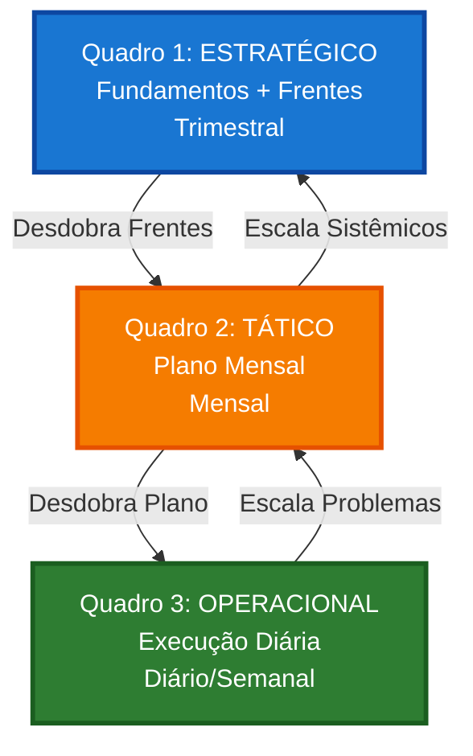

# 🚀 Modelo 3: Multi-Quadros por Camada

> **Autonomia total**: Cada nível de gestão opera independentemente com sincronização clara.

**[← Voltar para visão geral](quadro.md)** | **[← Modelo 2](quadro-modelo-2.md)**

---

## 💡 O Que É o Modelo 3?

O **Modelo 3** é a estrutura mais avançada, com **3 quadros independentes** por nível de gestão:

- **Quadro 1: Estratégico** — CEO, C-level (Trimestral)
- **Quadro 2: Tático** — Coordenadores, gerentes (Mensal)
- **Quadro 3: Operacional** — Equipe executiva (Semanal/Diário)

**Diferença principal do Modelo 2:** Separa totalmente o nível **tático** do **operacional**, dando autonomia máxima para cada camada.

---

## 🎯 Estrutura Completa

### Quadro 1: Estratégico (Trimestral)

**Quem usa:** CEO, fundadores, diretores, C-level

**Frequência:** Trimestral (revisão mensal de acompanhamento)

#### Colunas

| Coluna | Tipo | O Que Entra |
|--------|------|-------------|
| **🎯 Fundamentos** | 🔒 FIXA | Cartões fixos estratégicos |
| **🏛️ Frentes Trimestrais** | 🔒 FIXA | 3-5 grandes iniciativas |
| **💡 Ideias Estratégicas** | Fluxo | Inovações, apostas |
| **🚨 Problemas Sistêmicos** | Fluxo | Problemas estruturais |
| **✅ Concluído (Trimestre)** | Fluxo | Entregas trimestrais |

**Cartões fixos:** Mesmo do Modelo 1 e 2

**[→ Ver templates de cartões fixos](quadro-modelo-1.md#templates-de-cartoes-fixos)**

---

### Quadro 2: Tático (Mensal)

**Quem usa:** Coordenadores de área, gerentes, lideranças táticas

**Frequência:** Mensal (revisão semanal de acompanhamento)

#### Colunas

| Coluna | O Que Entra |
|--------|-------------|
| **📋 Plano do Mês** | Entregas mensais por área derivadas das Frentes |
| **💡 Ideias Táticas** | Melhorias de processo, eficiência |
| **🚨 Problemas Relevantes** | Problemas recorrentes da operação |
| **🔄 Em Execução** | Projetos e iniciativas do mês |
| **⏸️ Bloqueado** | Travado aguardando decisão/recurso |
| **✅ Concluído (Mês)** | Entregas do mês |

---

### Quadro 3: Operacional (Semanal/Diário)

**Quem usa:** Equipe executiva, operadores, time de execução

**Frequência:** Diário (planejamento semanal)

#### Colunas

| Coluna | O Que Entra |
|--------|-------------|
| **📋 Prioridades da Semana** | Ações prioritárias da semana |
| **☀️ Hoje** | Foco do dia (máximo 3 por pessoa) |
| **🔄 Em Andamento** | Executando agora |
| **⏸️ Bloqueado** | Impedimentos operacionais |
| **💡 Ideias** | Melhorias pequenas, sugestões |
| **✅ Concluído (Semana)** | Entregas da semana |

---

## 🔄 Fluxo Entre os 3 Quadros

### Visão Geral

### Fluxo Descendente (Estratégia → Execução)

**Trimestral → Mensal:**
1. Frentes Trimestrais são **desdobradas** em Plano do Mês
2. Cada Frente gera múltiplas entregas mensais
3. Coordenadores definem **como** executar

**Mensal → Semanal:**
1. Plano do Mês é **desdobrado** em Prioridades da Semana
2. Cada entrega mensal vira ações semanais
3. Equipe define **quem** e **quando**

**Semanal → Diário:**
1. Prioridades da Semana viram **foco do dia**
2. Máximo 3 ações por pessoa por dia
3. Atualização em tempo real

---

### Fluxo Ascendente (Problemas → Decisões)

#### Do Operacional → Tático

**Quando escalar:**
- ✅ Problema se repete **3+ vezes**
- ✅ Afeta **múltiplas pessoas**
- ✅ Não resolve em **1 semana**
- ✅ Exige **decisão de coordenação**

**Como escalar:**
1. Cria cartão no Quadro Tático (coluna "Problemas Relevantes")
2. Marca: "Escalado do Operacional - [Data]"
3. Vincula cartão original
4. Notifica coordenador responsável

---

#### Do Tático → Estratégico

**Quando escalar:**
- ✅ Problema **sistêmico/estrutural**
- ✅ Exige mudança de **prioridade trimestral**
- ✅ Exige **investimento significativo**
- ✅ Invalida **hipóteses estratégicas**
- ✅ Afeta **múltiplas áreas**

**Como escalar:**
1. Cria cartão no Quadro Estratégico (coluna "Problemas Sistêmicos")
2. Marca: "Escalado do Tático - [Data]"
3. Vincula cartão original
4. Notifica CEO/Liderança

---

## 🏷️ Sistema de Etiquetas

**Use o mesmo sistema nos 3 quadros:**

| Cor | Área | Quadro 1 | Quadro 2 | Quadro 3 |
|-----|------|----------|----------|----------|
| 🟦 Azul | Produção | ✅ | ✅ | ✅ |
| 🟩 Verde | Comercial | ✅ | ✅ | ✅ |
| 🟨 Amarelo | Financeiro | ✅ | ✅ | ✅ |
| 🟧 Laranja | Produto | ✅ | ✅ | ✅ |
| 🟪 Roxo | Pessoas | ✅ | ✅ | ✅ |
| 🟥 Vermelho | URGENTE | ❌ | ⚠️ Raro | ✅ |

!!! tip "Consistência é crítica"
    Mesmas cores = Mesmas áreas em todos os quadros. Facilita rastreamento de ponta a ponta.

---

## 🔄 Como Usar no Dia a Dia

### Ritual Diário (5-10 min)

**Quadro:** Apenas Operacional

**Quem:** Equipe executiva

**Ações:**
1. Revise coluna "☀️ Hoje"
2. Revise coluna "Em Andamento"
3. Atualize status
4. Identifique bloqueios → Move para "Bloqueado"
5. Conclua finalizadas → Move para "Concluído"

**Acessa outros quadros:** ❌ Não

---

### Ritual Semanal (30 min)

**Quadro:** Apenas Operacional

**Quem:** Equipe executiva + Coordenador (se necessário)

**Ações:**
1. Celebre coluna "Concluído (Semana)"
2. Defina "Prioridades da Semana" baseado no Plano do Mês
3. Resolva bloqueios ou escale
4. Arquive concluídos antigos
5. Identifique problemas recorrentes → Escale para Tático se necessário

**Acessa outros quadros:** Tático (consulta para priorizar)

---

### Ritual Mensal (1-2h)

**Quadros:** Tático + Operacional

**Quem:** Coordenadores + CEO (se necessário)

**No Quadro Estratégico (consulta rápida):**
- Consulte "Frentes Trimestrais" → Direciona plano do mês

**No Quadro Tático:**
1. Revise "Plano do Mês" anterior → O que foi concluído?
2. Crie "Plano do Mês" seguinte baseado nas Frentes
3. Triagem de "Ideias Táticas"
4. Revisão de "Problemas Relevantes" → Resolve ou escala
5. Atualize "Em Execução"

**No Quadro Operacional:**
6. Consolide conquistas do mês
7. Limpe quadro → Arquive antigo
8. Crie primeiras "Prioridades da Semana"

**Sincronização:** Tático → Operacional (obrigatória)

---

### Ritual Trimestral (2-4h)

**Quadros:** Estratégico + Tático

**Quem:** CEO, lideranças, coordenadores

**No Quadro Estratégico:**
1. Atualize 2 cartões fixos:
   - 🎯 Meta Trimestral
   - 🏛️ Pilares da Empresa
2. Revise 4 cartões fixos:
   - 📊 Indicadores Principais
   - 📈 Status do Trimestre
   - ⚠️ Riscos Monitorados
   - 🏆 Conquistas do Mês
3. Defina novas "Frentes Trimestrais"
4. Arquive concluídos do trimestre

**No Quadro Tático:**
5. Limpe tudo obsoleto
6. Crie "Plano do Mês" do primeiro mês do trimestre

**Sincronização:** Estratégico → Tático (obrigatória)

---

## 🔄 Migrando do Modelo 2

### Pré-requisitos

Antes de migrar, confirme:
- ✅ Modelo 2 funcionando há pelo menos **2 meses**
- ✅ Empresa tem **15+ pessoas**
- ✅ Múltiplas áreas independentes
- ✅ Quadro Tático mistura mensal com diário
- ✅ Precisa autonomia por camada

---

### Passo a Passo da Migração

#### 1. Prepare o Quadro Operacional

**Tempo:** 30 minutos

1. Crie novo quadro chamado "Operacional"
2. Crie 6 colunas:
   - 📋 Prioridades da Semana
   - ☀️ Hoje
   - 🔄 Em Andamento
   - ⏸️ Bloqueado
   - 💡 Ideias
   - ✅ Concluído (Semana)

---

#### 2. Separe Cartões do Tático

**Tempo:** 1 hora

**Do Quadro Tático/Operacional atual:**

**Mantém no Tático (renomear para apenas "Tático"):**
- Plano do Mês
- Ideias Táticas
- Problemas Relevantes
- Em Execução (projetos mensais)

**Move para Operacional:**
- Prioridades da Semana → Já existe
- Ações semanais/diárias
- Bloqueios operacionais
- Ideias pequenas

---

#### 3. Reorganize o Quadro Tático

**Tempo:** 30 minutos

**Novas colunas do Tático:**
1. 📋 Plano do Mês
2. 💡 Ideias Táticas
3. 🚨 Problemas Relevantes
4. 🔄 Em Execução
5. ⏸️ Bloqueado
6. ✅ Concluído (Mês)

**Delete:**
- Colunas de "Prioridades da Semana"
- Colunas de "Hoje"
- Tudo que é execução diária

---

#### 4. Defina Regras de Escalonamento

**Tempo:** 30 minutos

**Documente claramente:**

**Operacional → Tático:**
- 3+ ocorrências
- Afeta múltiplas pessoas
- Não resolve em 1 semana

**Tático → Estratégico:**
- Problema sistêmico
- Exige investimento
- Invalida estratégia

**Crie documento** ou cartão fixo com essas regras.

---

#### 5. Vincule os 3 Quadros

**Tempo:** 15 minutos

1. No Quadro Estratégico: Links para Tático e Operacional
2. No Quadro Tático: Links para Estratégico e Operacional
3. No Quadro Operacional: Links para Tático e Estratégico

---

#### 6. Defina Donos de Quadro

**Tempo:** 15 minutos

**Estratégico:**
- Dono: CEO
- Participantes: C-level, fundadores

**Tático:**
- Dono: Coordenador Geral ou COO
- Participantes: Coordenadores de área

**Operacional:**
- Dono: Gerente de Operações
- Participantes: Toda equipe executiva

---

#### 7. Treine Cada Nível Separadamente

**Tempo:** 3 horas (1h por nível)

**Treino por nível:**

**Estratégico (1h):**
- Apenas lideranças
- Foco: Frentes, desdobramento, escalonamento

**Tático (1h):**
- Coordenadores
- Foco: Plano do mês, conexão com estratégia e operação

**Operacional (1h):**
- Toda equipe
- Foco: Diário/semanal, quando escalar

---

#### 8. Rode Primeiro Ciclo Completo

**Tempo:** 1 semana

**Dia 1:** Ritual trimestral no Estratégico  
**Dia 2:** Ritual mensal no Tático (desdobra Frentes)  
**Dia 3:** Ritual semanal no Operacional (desdobra Plano)  
**Dias 4-7:** Rituais diários no Operacional

**Validação:** Sistema funcionando end-to-end

---

### Checklist de Migração

- [ ] Quadro Operacional criado com 6 colunas
- [ ] Cartões movidos do Tático para Operacional
- [ ] Quadro Tático reorganizado (6 colunas)
- [ ] Quadro Estratégico inalterado
- [ ] Regras de escalonamento documentadas
- [ ] Links entre 3 quadros adicionados
- [ ] Donos de cada quadro definidos
- [ ] 3 níveis treinados separadamente
- [ ] Primeiro ciclo completo executado
- [ ] Sistema funcionando

**Tempo total:** 2-3 dias de trabalho + 2 semanas de adaptação

---

## 📊 Métricas de Saúde

### Por Quadro

#### Quadro Estratégico

| Métrica | Meta |
|---------|------|
| Cartões fixos atualizados | 100% mensal |
| Frentes no prazo | >80% |
| Taxa de escalonamento do Tático | <10% |

#### Quadro Tático

| Métrica | Meta |
|---------|------|
| Plano do mês concluído | >80% |
| Tempo de resolução de problema | <30 dias |
| Taxa de escalonamento para Estratégico | <10% |
| Taxa de escalonamento do Operacional | 10-20% |

#### Quadro Operacional

| Métrica | Meta |
|---------|------|
| Taxa de conclusão semanal | >80% |
| WIP por pessoa | 3-5 |
| Taxa de bloqueio | <20% |
| Tempo médio de conclusão | <7 dias |

---

## ⚠️ Armadilhas Comuns

### 1. Silos Entre Níveis

**Problema:** Quadros operam sem conexão

**Solução:**
- Sincronização mensal **obrigatória** (Estratégico + Tático)
- Sincronização semanal **obrigatória** (Tático + Operacional)
- Links visíveis entre quadros
- Donos conversam regularmente

---

### 2. Escalonamento Quebrado

**Problema:** Problemas não sobem ou sobem demais

**Solução:**
- Regras claras e documentadas
- Treinamento sobre quando escalar
- Revisão mensal de escalonamentos
- Feedback sobre decisões

---

### 3. Operação Perde Visão Estratégica

**Problema:** Equipe executa sem entender "por quê"

**Solução:**
- Comunicar Frentes Trimestrais para todos
- Vincular ações operacionais às Frentes
- Celebrar conquistas que impactam estratégia
- Rituais mensais com todos os níveis

---

### 4. Sobrecarga de Sincronização

**Problema:** Tempo excessivo mantendo quadros

**Solução:**
- Automatizar o que puder (links, notificações)
- Rituais disciplinados (não pule)
- Donos de quadro responsáveis
- Revisar eficiência trimestralmente

---

## 🎯 Modelo 3 é o Teto

### Não Há Modelo 4

O Modelo 3 é o **nível máximo** de sofisticação. Se a empresa crescer ainda mais:

**Não crie mais níveis, replique o modelo:**
- Modelo 3 por **unidade de negócio**
- Modelo 3 por **região geográfica**
- Modelo 3 por **divisão**

**Mantém:** 3 camadas (Estratégico, Tático, Operacional)

---

## ❓ Perguntas Frequentes

??? question "Preciso dos 3 quadros abertos sempre?"
    **Não! Cada nível trabalha no seu:**
    
    - **CEO/Liderança:** Principalmente Estratégico
    - **Coordenadores:** Principalmente Tático (consulta Estratégico)
    - **Equipe:** Principalmente Operacional (consulta Tático)
    
    Sincronização acontece nos rituais.

??? question "Como garantir que nada se perde entre quadros?"
    **Vínculos obrigatórios:**
    
    - Toda Frente lista prioridades vinculadas
    - Todo Plano do Mês referencia Frente origem
    - Toda Prioridade da Semana referencia Plano
    - Todo escalonamento vincula cartão original

??? question "E se um nível não funcionar bem?"
    **Volte para Modelo 2 temporariamente:**
    
    - Junte Tático + Operacional
    - Mantenha Estratégico separado
    - Corrija problemas
    - Migre novamente quando pronto

??? question "Quanto tempo para dominar o Modelo 3?"
    **2-3 meses mínimo:**
    
    - Semanas 1-2: Adaptação e confusão
    - Semanas 3-6: Começando a funcionar
    - Semanas 7-12: Fluidez e benefícios claros
    
    Paciência é essencial.

---

## 📚 Recursos Relacionados

- **[← Voltar para visão geral](quadro.md)**
- **[← Modelo 1: Base](quadro-modelo-1.md)**
- **[← Modelo 2: Evolução](quadro-modelo-2.md)**
- **[Rituais](rituais/index.md)** — Como usar nos rituais
- **[Indicadores](indicadores.md)** — Métricas para cartões fixos

---

  <strong>Modelo 3</strong> — Autonomia total: 3 camadas sincronizadas 🚀

