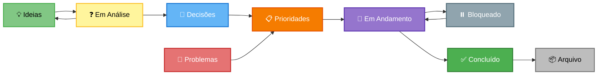
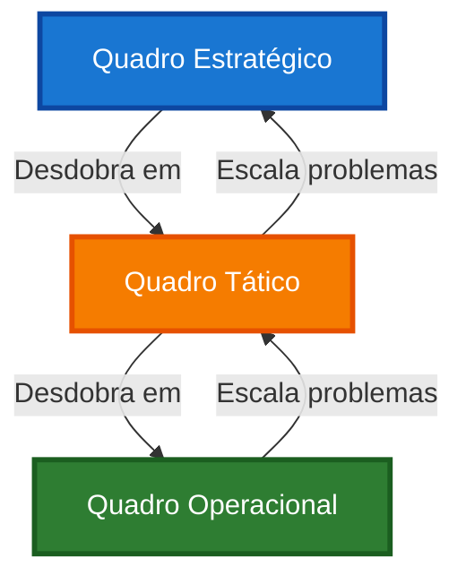

# 📋 Quadro Kanban — Gestão Visual

> **Gestão visual simples e eficaz**: acompanhe ideias, problemas, decisões e prioridades em um sistema que funciona.

---

## 💡 O Que É o Quadro Kanban?

O **Quadro Kanban** é o coração operacional do sistema. É onde você:

- 👁️ **Visualiza** tudo que está acontecendo
- 🔄 **Acompanha** o fluxo de trabalho
- 🎯 **Prioriza** o que importa
- 📊 **Gerencia** ideias, problemas, decisões e ações
- ✅ **Celebra** conquistas

!!! tip "Por que Kanban?"
    - **Visual**: Vê tudo de uma vez
    - **Simples**: Fácil de entender e usar
    - **Flexível**: Adapta ao seu contexto
    - **Eficaz**: Mantém foco e fluxo

---

## 🎯 Duas Abordagens de Gestão

Você pode escolher entre duas abordagens, dependendo do tamanho e complexidade da sua empresa.

### Abordagem 1: Quadro Único Centralizado

**Para quem:** Empresas pequenas (1-10 pessoas) ou iniciantes

**Vantagens:**

- ✅ Tudo em um só lugar  
- ✅ Visão completa da empresa  
- ✅ Simples de manter  
- ✅ Fácil de entender

**Desvantagens:**

- ⚠️ Pode ficar poluído com muitos cartões  
- ⚠️ Dificulta filtros específicos  
- ⚠️ Mistura níveis diferentes

### Abordagem 2: Quadros por Camada

**Para quem:** Empresas maiores (10+ pessoas) ou com operação complexa

**Vantagens:**

- ✅ Foco por nível (estratégico, tático, operacional)  
- ✅ Menos poluição visual  
- ✅ Filtros naturais por contexto  
- ✅ Escalável

**Desvantagens:**

- ⚠️ Precisa manter múltiplos quadros  
- ⚠️ Pode perder visão do todo  
- ⚠️ Requer mais disciplina

---

## 📊 Abordagem 1: Quadro Único Centralizado

### Estrutura do Quadro

Um único quadro com todas as colunas necessárias para gerenciar toda a empresa.

| Coluna | O Que Entra | Quando Move |
|--------|-------------|-------------|
| **💡 Ideias** | Sugestões, oportunidades, melhorias | Quando vira decisão ou é descartada |
| **❓ Em Análise** | Ideias sendo avaliadas | Quando vira decisão ou volta para ideias |
| **🎯 Decisões** | Escolhas aprovadas | Quando vira ação ou é arquivada |
| **🚨 Problemas** | Falhas, riscos, bloqueios | Quando vira prioridade ou é resolvido |
| **📋 Prioridades** | O que PRECISA ser feito | Quando entra em execução |
| **🔄 Em Andamento** | Ações sendo executadas | Quando é concluída ou bloqueada |
| **⏸️ Bloqueado** | Ações travadas | Quando bloqueio é removido |
| **✅ Concluído** | Itens finalizados (últimos 7 dias) | Após 7 dias, arquiva |
| **📦 Arquivo** | Histórico de longo prazo | Permanece para consulta |

### Fluxo de Cartões



### Etiquetas (Labels)

Use etiquetas coloridas para organizar cartões. **Máximo 6-8 etiquetas** para manter simples.

#### Sistema Recomendado (6 etiquetas)

**Por Área/Setor** (use cores):

- 🟦 **Azul** = Produção/Operações  
- 🟩 **Verde** = Comercial/Vendas  
- 🟨 **Amarelo** = Financeiro  
- 🟧 **Laranja** = Produto/Desenvolvimento  
- 🟪 **Roxo** = Pessoas/Cultura  
- 🟥 **Vermelho** = URGENTE (use com moderação!)

!!! tip "Como usar etiquetas"
    - **1 cor por cartão** = Área responsável
    - **Vermelho** = Só para urgências reais
    - **Sem etiqueta** = Geral/Múltiplas áreas
    
    Exemplo: Cartão de "Contratar vendedor" = 🟩 Verde (Comercial)

#### Sistema Alternativo (Prioridade)

Se preferir priorizar por urgência:

- 🟥 **Vermelho** = Urgente (fazer hoje/amanhã)  
- 🟧 **Laranja** = Alta (fazer esta semana)  
- 🟨 **Amarelo** = Média (fazer este mês)  
- 🟩 **Verde** = Baixa (quando possível)

!!! warning "Não misture sistemas"
    Escolha **UM** sistema de etiquetas e use consistentemente:
    
    - **OU** etiquetas por área  
    - **OU** etiquetas por prioridade
    
    Misturar os dois gera confusão!

### Como Usar no Dia a Dia

#### Ritual Diário (10-15 min)

1. **Revise** coluna "Em Andamento"  
2. **Atualize** status dos cartões  
3. **Identifique** bloqueios → Move para "Bloqueado"  
4. **Inicie** novas ações → Move de "Prioridades" para "Em Andamento"  
5. **Conclua** ações → Move para "Concluído"

#### Ritual Semanal (30-60 min)

1. **Revise** coluna "Concluído" → Celebre conquistas  
2. **Revise** coluna "Bloqueado" → Resolva ou escale  
3. **Revise** coluna "Prioridades" → Ajuste ordem  
4. **Adicione** novas prioridades da semana  
5. **Arquive** concluídos com mais de 7 dias

#### Ritual Mensal (1-2h)

1. **Revise** todas as colunas  
2. **Triagem** de "Ideias" → Move para "Em Análise" ou descarta  
3. **Avalie** "Em Análise" → Vira "Decisões" ou volta  
4. **Revise** "Problemas" → Vira "Prioridades" ou resolve  
5. **Limpe** quadro → Arquive o que não é mais relevante

#### Ritual Trimestral (2-4h)

1. **Revisão completa** do quadro  
2. **Arquive** tudo que não é mais relevante  
3. **Crie** cartões das prioridades trimestrais  
4. **Reorganize** etiquetas se necessário  
5. **Limpe** arquivo antigo (>90 dias)

### Regras do Quadro Único

!!! warning "Regras Importantes"
    1. **Limite WIP**: Máximo 5-7 cartões "Em Andamento" por pessoa  
    2. **Bloqueios visíveis**: Sempre marque e comunique  
    3. **Atualização diária**: Mova cartões conforme progresso  
    4. **Limpeza semanal**: Arquive concluídos antigos  
    5. **Triagem mensal**: Não deixe ideias acumularem

---

## 📊 Abordagem 2: Quadros por Camada

### Estrutura Multi-Quadro

Três quadros separados por nível de gestão:

#### Quadro 1: Estratégico (Trimestral)

**Quem usa:** CEO, fundadores, lideranças estratégicas

**Colunas:**

| Coluna | O Que Entra |
|--------|-------------|
| **🎯 Objetivos Trimestrais** | Metas do trimestre |
| **🏛️ Frentes Estratégicas** | Grandes iniciativas |
| **💡 Ideias Estratégicas** | Inovações, apostas |
| **🚨 Problemas Sistêmicos** | Problemas estruturais |
| **🎯 Decisões Estratégicas** | Escolhas de alto impacto |
| **✅ Concluído (Trimestre)** | Entregas do trimestre |

**Etiquetas:**

- Por pilar da empresa  
- Por frente estratégica  
- Por trimestre

**Quando revisar:**

- **Trimestral**: Revisão completa  
- **Mensal**: Acompanhamento de progresso  
- **Semanal**: Não revisa (só se houver urgência)

---

#### Quadro 2: Tático (Mensal)

**Quem usa:** Coordenadores de área, gerentes

**Colunas:**

| Coluna | O Que Entra |
|--------|-------------|
| **📋 Plano do Mês** | Entregas mensais |
| **💡 Ideias Táticas** | Melhorias de processo |
| **🚨 Problemas Relevantes** | Problemas recorrentes |
| **🎯 Decisões Táticas** | Ajustes de plano |
| **🔄 Em Execução** | Ações do mês |
| **⏸️ Bloqueado** | Travado |
| **✅ Concluído (Mês)** | Entregas do mês |

**Etiquetas:**

- Por área/setor  
- Por frente estratégica  
- Por mês

**Quando revisar:**

- **Mensal**: Revisão completa  
- **Semanal**: Acompanhamento de progresso  
- **Diário**: Não revisa (só se houver urgência)

---

#### Quadro 3: Operacional (Semanal/Diário)

**Quem usa:** Equipe executiva, operacional

**Colunas:**

| Coluna | O Que Entra |
|--------|-------------|
| **📋 Prioridades da Semana** | Ações prioritárias |
| **☀️ Hoje** | Foco do dia |
| **🔄 Em Andamento** | Executando agora |
| **⏸️ Bloqueado** | Impedimentos |
| **💡 Ideias Operacionais** | Melhorias pequenas |
| **✅ Concluído (Semana)** | Entregas da semana |

**Etiquetas:**

- Por responsável  
- Por área  
- Por dia da semana

**Quando revisar:**

- **Diário**: Revisão completa  
- **Semanal**: Planejamento e fechamento  
- **Mensal**: Não revisa (só consolida)

---

### Fluxo Entre Quadros



### Regras de Escalonamento

#### Do Operacional para o Tático

**Quando escalar:**

- Problema recorrente (3+ vezes)  
- Afeta múltiplas pessoas/áreas  
- Exige decisão de coordenação  
- Não resolve em 1 semana

**Como escalar:**

- Cria cartão no Quadro Tático  
- Marca origem: "Escalado do Operacional"  
- Vincula ao cartão original

#### Do Tático para o Estratégico

**Quando escalar:**

- Problema sistêmico/estrutural  
- Exige mudança de prioridade trimestral  
- Exige investimento significativo  
- Invalida hipóteses estratégicas

**Como escalar:**

- Cria cartão no Quadro Estratégico  
- Marca origem: "Escalado do Tático"  
- Vincula ao cartão original

---

## 🏷️ Sistema de Etiquetas Simplificado

### Realidade do Trello/Kanban

A maioria das ferramentas Kanban (Trello, Notion, etc.) oferece **etiquetas coloridas simples**. Não há múltiplas camadas ou tipos complexos.

!!! info "Limitação prática"
    Ferramentas como Trello oferecem:
    
    - 10 cores de etiquetas  
    - 1 nome por etiqueta  
    - Sem hierarquia ou tipos
    
    Por isso, **escolha UM critério** e use consistentemente.

### Opção 1: Etiquetas por Área (Recomendado)

**Melhor para:** Empresas com múltiplas áreas/setores

| Cor | Área | Quando Usar |
|-----|------|-------------|
| 🟦 Azul | Produção | Cartões de operações, fabricação |
| 🟩 Verde | Comercial | Cartões de vendas, atendimento |
| 🟨 Amarelo | Financeiro | Cartões de finanças, custos |
| 🟧 Laranja | Produto | Cartões de desenvolvimento |
| 🟪 Roxo | Pessoas | Cartões de RH, cultura |
| 🟥 Vermelho | URGENTE | Só para crises reais |

**Como usar:**

- Cada cartão recebe **1 cor** = área responsável  
- Vermelho = reservado para urgências  
- Sem cor = geral ou múltiplas áreas

### Opção 2: Etiquetas por Prioridade

**Melhor para:** Empresas pequenas ou foco em urgência

| Cor | Prioridade | Prazo |
|-----|------------|-------|
| 🟥 Vermelho | Crítico | Hoje/Amanhã |
| 🟧 Laranja | Alta | Esta semana |
| 🟨 Amarelo | Média | Este mês |
| 🟩 Verde | Baixa | Quando possível |
| 🟦 Azul | Backlog | Futuro |

**Como usar:**

- Cada cartão recebe **1 cor** = urgência  
- Mude a cor conforme prazo se aproxima  
- Evite ter muitos "vermelhos" (perde significado)

### Opção 3: Etiquetas por Tipo de Cartão

**Melhor para:** Empresas que querem separar ideias, problemas e ações

| Cor | Tipo | Descrição |
|-----|------|-----------|
| 🟢 Verde | Ideia | Sugestões, oportunidades |
| 🟥 Vermelho | Problema | Falhas, riscos, bloqueios |
| 🟦 Azul | Decisão | Escolhas aprovadas |
| 🟨 Amarelo | Ação | Tarefas executáveis |
| 🟪 Roxo | Experimento | Testes, validações |

**Como usar:**

- Cada cartão recebe **1 cor** = tipo  
- Facilita filtrar por categoria  
- Útil para triagem

### Qual Opção Escolher?

!!! tip "Recomendação"
    **Comece com Opção 1 (Por Área)**
    
    É a mais prática porque:
    
    - Mostra quem é responsável  
    - Facilita distribuição de trabalho  
    - Funciona em qualquer ritual  
    - Escala bem
    
    **Use Opção 2** se sua empresa é muito pequena (1-3 pessoas) e prioridade é mais importante que área.
    
    **Use Opção 3** se você quer separar claramente ideias de problemas de ações.

### Regras de Uso

1. **Escolha UM sistema** e use consistentemente  
2. **Não misture** sistemas diferentes  
3. **Máximo 1-2 etiquetas** por cartão  
4. **Evite criar muitas etiquetas** (máximo 6-8)  
5. **Revise etiquetas** trimestralmente

---

## 📝 Anatomia de um Cartão

### Estrutura Mínima

Todo cartão deve ter:

```
Título: [Verbo] + [Objeto] + [Resultado esperado]
Exemplo: "Implementar controle de estoque para reduzir perdas"

Descrição:
- Contexto: Por que isso é necessário?  
- Objetivo: O que queremos alcançar?  
- Critério de sucesso: Como saber que está pronto?

Responsável: Nome da pessoa
Prazo: Data limite
Etiqueta: [1 cor conforme sistema escolhido]
```

### Exemplo de Cartão Bem Feito

!!! example "Cartão: Implementar controle de estoque"
    **Etiqueta:** 🟦 Azul (Produção)
    
    **Contexto:**  
    Estamos perdendo 15% dos materiais por falta de controle. Isso impacta margem de lucro.
    
    **Objetivo:**  
    Criar sistema simples de entrada/saída de materiais para reduzir perdas para <5%.
    
    **Critério de sucesso:**  
    - [ ] Planilha de controle criada  
    - [ ] Processo de registro definido  
    - [ ] Equipe treinada  
    - [ ] Perdas medidas por 1 mês
    
    **Responsável:** João (Produção)  
    **Prazo:** 30/04/2026  
    **Coluna:** Prioridades

---

## 🔄 Ciclo de Vida dos Cartões

### 1. Criação

**Quando criar:**

- Durante rituais (principal)  
- Quando surge urgência  
- Quando identifica oportunidade

**Como criar:**

- Título claro e objetivo  
- Descrição com contexto  
- Etiqueta correta (1 cor)  
- Responsável definido

### 2. Priorização

**Critérios:**

- Impacto no objetivo trimestral  
- Urgência real (não aparente)  
- Esforço necessário  
- Dependências

**Técnica:** Matriz Impacto x Esforço

| Impacto | Esforço Baixo | Esforço Alto |
|---------|---------------|--------------|
| **Alto** | 🎉 Faça JÁ | 🎯 Planeje bem |
| **Baixo** | 🟢 Se sobrar tempo | 🚫 Não faça |

### 3. Execução

**Boas práticas:**

- Atualiza status diariamente  
- Comunica bloqueios imediatamente  
- Pede ajuda quando necessário  
- Documenta decisões tomadas

### 4. Conclusão

**Antes de marcar como concluído:**

- [ ] Critérios de sucesso atingidos?  
- [ ] Resultado documentado?  
- [ ] Aprendizados registrados?  
- [ ] Próximos passos definidos (se houver)?

### 5. Arquivo

**Quando arquivar:**

- Concluído há mais de 7 dias  
- Cancelado/descartado  
- Não é mais relevante

**Como arquivar:**

- Move para coluna "Arquivo"  
- Adiciona nota de fechamento  
- Mantém para histórico

---

## 📊 Métricas do Quadro

### Indicadores de Saúde

Acompanhe mensalmente:

| Métrica | Como Calcular | Meta |
|---------|---------------|------|
| **Taxa de Conclusão** | Concluídos / Planejados | >80% |
| **Tempo Médio** | Dias entre criação e conclusão | <14 dias |
| **Taxa de Bloqueio** | Bloqueados / Em Andamento | <20% |
| **WIP por Pessoa** | Em Andamento / Pessoas | 3-5 |
| **Taxa de Escalonamento** | Escalados / Total | <10% |

### Sinais de Alerta

🚨 **Quadro com problemas:**

- Muitos cartões "Em Andamento" (>10 por pessoa)  
- Cartões parados há muito tempo (>30 dias)  
- Muitos bloqueios não resolvidos  
- Coluna "Ideias" muito cheia (>20 cartões)  
- Nada sendo concluído

✅ **Quadro saudável:**

- Fluxo constante de conclusões  
- WIP controlado (3-5 por pessoa)  
- Bloqueios resolvidos rapidamente  
- Ideias sendo triadas regularmente  
- Prioridades claras

---

## 🎯 Qual Abordagem Escolher?

### Use Quadro Único se:

- ✅ Empresa tem 1-10 pessoas  
- ✅ Operação é simples  
- ✅ Está começando com Kanban  
- ✅ Prefere simplicidade

### Use Quadros por Camada se:

- ✅ Empresa tem 10+ pessoas  
- ✅ Operação é complexa  
- ✅ Já domina Kanban básico  
- ✅ Precisa de foco por nível

### Pode Migrar?

**Sim!** Comece com Quadro Único e migre quando:

- Quadro ficar muito poluído (>50 cartões)  
- Dificuldade em filtrar por nível  
- Equipe crescer (>10 pessoas)  
- Operação ficar mais complexa

---

## ❓ Perguntas Frequentes

??? question "Quantos cartões posso ter 'Em Andamento'?"
    **Regra geral:** 3-5 por pessoa
    
    - Menos que 3 = Pode estar subutilizado  
    - Mais que 5 = Está disperso demais  
    - Ideal = 3-4 cartões focados

??? question "O que fazer com ideias que não vão ser feitas?"
    **Não deixe acumular!**
    
    - Avalie mensalmente  
    - Descarte o que não faz sentido  
    - Arquive o que pode ser útil no futuro  
    - Mantenha só o que tem potencial real

??? question "Como lidar com urgências?"
    **Crie cartão e priorize:**
    
    1. Cria cartão com etiqueta 🟥 Vermelho (Urgente)  
    2. Move direto para "Em Andamento"  
    3. Pausa outros cartões se necessário  
    4. Resolve a urgência  
    5. Volta ao fluxo normal

??? question "Preciso de ferramenta digital?"
    **Não necessariamente!**
    
    - **Físico**: Post-its em quadro branco (simples, visual)  
    - **Digital**: Trello, Notion, Asana (flexível, remoto)  
    - **Híbrido**: Quadro físico + foto diária
    
    Escolha o que funciona para sua equipe.

??? question "Como evitar que o quadro fique bagunçado?"
    **Disciplina e rituais:**
    
    - Atualização diária obrigatória  
    - Limpeza semanal  
    - Triagem mensal  
    - Revisão trimestral  
    - Limite de WIP  
    - Arquivamento regular

??? question "E se ninguém atualizar o quadro?"
    **Crie o hábito:**
    
    - Inclua nos rituais diários  
    - Responsabilize cada pessoa  
    - Mostre benefícios (visibilidade, reconhecimento)  
    - Lidere pelo exemplo  
    - Celebre quem mantém atualizado

---

## 🚀 Primeiros Passos

### Para Começar com Quadro Único

1. **Crie as colunas** (físico ou digital)  
2. **Defina etiquetas** básicas (escolha 1 sistema)  
3. **Migre cartões** do ritual trimestral  
4. **Treine equipe** em 30 minutos  
5. **Comece a usar** nos rituais diários

### Para Começar com Quadros por Camada

1. **Crie os 3 quadros** separados  
2. **Defina etiquetas** por quadro (mesmo sistema em todos)  
3. **Distribua cartões** por nível  
4. **Defina responsáveis** por quadro  
5. **Estabeleça regras** de escalonamento

---

## 📚 Recursos Adicionais

- **[Rituais](rituais/trimestral.md)** — Como usar o quadro em cada ritual
- **[Painel](painel.md)** — Visão consolidada da empresa
- **[Indicadores](indicadores.md)** — Métricas para acompanhar

---

<p align="center">
  <strong>Quadro Kanban</strong> — Gestão visual que funciona 📋
</p>
