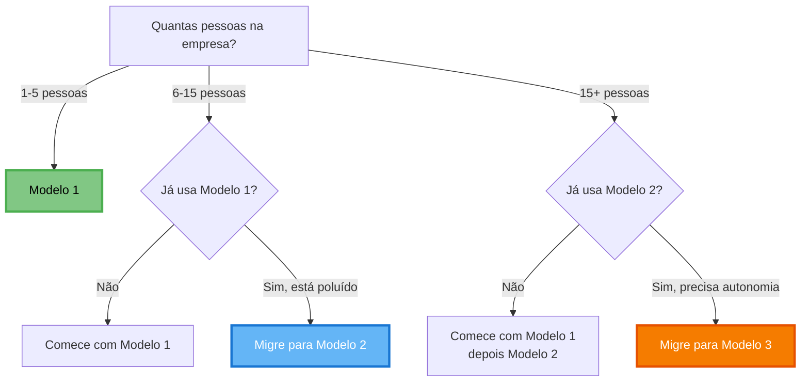

# 📋 Quadro Kanban — Gestão Visual

> **Gestão visual que evolui com sua empresa**: comece simples, evolua conforme amadurece.

---

## 💡 O Que É o Quadro Kanban?

O **Quadro Kanban** é o coração operacional do sistema. É onde você:

- 👁️ **Visualiza** tudo que está acontecendo
- 🔄 **Acompanha** o fluxo de trabalho
- 🎯 **Prioriza** o que importa
- 📊 **Gerencia** estratégia + operação
- ✅ **Celebra** conquistas

!!! tip "Por que Kanban?"
    
    - **Visual**: Vê tudo de uma vez
    - **Simples**: Fácil de entender e usar
    - **Flexível**: Adapta ao seu contexto
    - **Eficaz**: Mantém foco e fluxo

---

## 🎯 3 Modelos Evolutivos

Este sistema oferece **3 modelos de Quadro Kanban** que evoluem com sua empresa:

| Modelo | Nome | Para Quem |
|--------|------|-----------|
| **[Modelo 1](quadro-modelo-1.md)** | Quadro Único Unificado | Empresas 1-10 pessoas |
| **[Modelo 2](quadro-modelo-2.md)** | Separação Tática | Empresas 6-15 pessoas |
| **[Modelo 3](quadro-modelo-3.md)** | Multi-Quadros por Camada | Empresas 15+ pessoas |

!!! warning "Comece sempre pelo Modelo 1"
    **Não pule etapas!** Mesmo empresas grandes devem começar pelo Modelo 1 para entender a lógica antes de evoluir.

---

## 📊 Comparação Completa dos Modelos

### Visão Geral

| Aspecto | Modelo 1 | Modelo 2 | Modelo 3 |
|---------|----------|----------|----------|
| **Quantidade de quadros** | 1 único | 2 quadros | 3 quadros |
| **Pessoas recomendadas** | 1-10 | 6-15 | 15+ |
| **Complexidade** | Baixa | Média | Alta |
| **Tempo para implementar** | 2-3 horas | 1 dia | 2-3 dias |
| **Disciplina exigida** | Baixa | Média | Alta |
| **Precisa de Painel separado?** | ❌ Não | ❌ Não | ❌ Não |
| **Cartões fixos estratégicos** | No quadro único | No quadro estratégico | No quadro estratégico |
| **Autonomia por nível** | Nenhuma (tudo junto) | Parcial | Total |

---

## ✅ Modelo 1: Quadro Único Unificado

### O Que É?

Um **único quadro** que unifica Painel + Gestão Operacional. Possui uma coluna fixa com cartões estratégicos e colunas de fluxo para execução.

### Estrutura

- **1 coluna fixa** → 🎯 Decisões Estratégicas (cartões fixos)
- **5 colunas de fluxo** → Ideias, Problemas, Prioridades, Em Andamento, Concluído

### Vantagens ✅

- ✅ **Tudo em um lugar** — Não precisa alternar entre Painel e Quadro
- ✅ **Simples de implementar** — 2-3 horas e está funcionando
- ✅ **Fácil de manter** — Um único lugar para atualizar
- ✅ **Estratégia sempre visível** — Cartões fixos lembram fundamentos
- ✅ **Não precisa de Painel separado** — Economiza tempo
- ✅ **Ideal para começar** — Aprende o sistema sem complexidade

### Desvantagens ⚠️

- ⚠️ **Pode poluir** — Com muitos cartões operacionais (>30)
- ⚠️ **Mistura níveis** — Estratégia e operação no mesmo lugar
- ⚠️ **Dificulta filtros** — Não separa por horizonte temporal
- ⚠️ **Limitado para equipes grandes** — Acima de 10 pessoas fica confuso

### Quando Usar

**Use Modelo 1 se:**

- ✅ Empresa tem 1-10 pessoas
- ✅ Está começando com o sistema
- ✅ Operação é simples
- ✅ Prefere simplicidade acima de tudo
- ✅ Quer resultado rápido

**NÃO use Modelo 1 se:**

- ❌ Empresa já tem 15+ pessoas
- ❌ Múltiplas áreas independentes
- ❌ Operação muito complexa
- ❌ Precisa de autonomia por nível

### Quando Evoluir?

Migre para Modelo 2 quando:

- Quadro tiver **mais de 30 cartões operacionais** (além dos fixos)
- Sentir que **mistura demais** estratégia com operação
- Equipe crescer para **6+ pessoas**
- Dificuldade em **encontrar** o que precisa

**[→ Ver detalhes do Modelo 1](quadro-modelo-1.md)**

---

## 📊 Modelo 2: Separação Tática

### O Que É?

**Dois quadros separados**: um Estratégico (fundamentos + frentes trimestrais) e outro Tático/Operacional (execução).

### Estrutura

- **Quadro 1: Estratégico** → Cartões fixos + Frentes trimestrais
- **Quadro 2: Tático/Operacional** → Prioridades + Execução

### Vantagens ✅

- ✅ **Menos poluição visual** — Cada quadro tem foco específico
- ✅ **Estratégia isolada** — Fundamentos não se perdem
- ✅ **Operação mais fluída** — Quadro tático fica limpo
- ✅ **Fácil de filtrar** — Sabe onde procurar cada coisa
- ✅ **Escalável** — Funciona até 15 pessoas
- ✅ **Mantém visibilidade** — Estratégia acessível quando precisa

### Desvantagens ⚠️

- ⚠️ **Dois lugares** — Precisa manter dois quadros sincronizados
- ⚠️ **Risco de desconexão** — Operação pode esquecer estratégia
- ⚠️ **Mais disciplina** — Exige ritual mensal para sincronizar
- ⚠️ **Escalonamento** — Precisa definir quando subir problemas

### Quando Usar

**Use Modelo 2 se:**

- ✅ Empresa tem 6-15 pessoas
- ✅ Modelo 1 está poluído (>30 cartões)
- ✅ Já domina o Modelo 1
- ✅ Precisa separar estratégia de operação
- ✅ Equipe consegue manter disciplina

**NÃO use Modelo 2 se:**

- ❌ Empresa tem menos de 6 pessoas (use Modelo 1)
- ❌ Não consegue manter dois quadros atualizados
- ❌ Operação é muito simples (Modelo 1 basta)

### Quando Evoluir?

Migre para Modelo 3 quando:

- Empresa tiver **15+ pessoas**
- Múltiplas áreas/departamentos **independentes**
- Operação **muito complexa**
- Time tático precisa de **autonomia total**

**[→ Ver detalhes do Modelo 2](quadro-modelo-2.md)**

---

## 🚀 Modelo 3: Multi-Quadros por Camada

### O Que É?

**Três quadros independentes** por nível de gestão: Estratégico (trimestral), Tático (mensal) e Operacional (semanal/diário).

### Estrutura

- **Quadro 1: Estratégico** → CEO, fundadores (trimestral)
- **Quadro 2: Tático** → Coordenadores, gerentes (mensal)
- **Quadro 3: Operacional** → Equipe executiva (semanal/diário)

### Vantagens ✅

- ✅ **Máxima autonomia** — Cada nível opera independentemente
- ✅ **Foco total** — Operação não se distrai com estratégia
- ✅ **Altamente escalável** — Funciona para 50+ pessoas
- ✅ **Padrão profissional** — Modelo usado por empresas maduras
- ✅ **Clareza de papéis** — Cada quadro tem dono e responsável
- ✅ **Filtros naturais** — Informação certa para pessoa certa

### Desvantagens ⚠️

- ⚠️ **Complexo** — Exige disciplina para manter 3 quadros
- ⚠️ **Pode desconectar** — Risco de silos entre níveis
- ⚠️ **Mais trabalho** — Sincronização entre quadros dá trabalho
- ⚠️ **Curva de aprendizado** — Demora para equipe dominar
- ⚠️ **Escalonamento crítico** — Precisa de regras claras

### Quando Usar

**Use Modelo 3 se:**

- ✅ Empresa tem 15+ pessoas
- ✅ Já domina Modelo 2
- ✅ Múltiplas áreas independentes
- ✅ Operação muito complexa
- ✅ Equipe consegue manter alta disciplina
- ✅ Precisa de autonomia por nível

**NÃO use Modelo 3 se:**

- ❌ Empresa tem menos de 15 pessoas
- ❌ Não domina Modelo 2 ainda
- ❌ Não consegue manter 3 quadros sincronizados
- ❌ Operação é relativamente simples

### Quando Evoluir?

Modelo 3 é o **nível máximo**. Não há evolução além dele. Se a empresa crescer ainda mais, você:

- Replica o modelo por unidade de negócio
- Cria quadros táticos por departamento
- Mantém a mesma estrutura de 3 camadas

**[→ Ver detalhes do Modelo 3](quadro-modelo-3.md)**

---

## 🎯 Qual Modelo Escolher?

### Árvore de Decisão



### Recomendação por Tamanho

| Tamanho | Modelo Recomendado | Por Que |
|---------|-------------------|---------|
| **1-5 pessoas** | Modelo 1 | Simplicidade essencial, tudo em um lugar |
| **6-10 pessoas** | Modelo 1 → Modelo 2 | Comece simples, evolua se poluir |
| **11-15 pessoas** | Modelo 2 | Separação necessária, ainda gerenciável |
| **16-30 pessoas** | Modelo 2 → Modelo 3 | Precisa autonomia, mas comece pelo 2 |
| **30+ pessoas** | Modelo 3 | Autonomia por camada é essencial |

---

## 🚀 Como Migrar Entre Modelos

### De Modelo 1 → Modelo 2

**Esforço:** 1 dia de trabalho + 1 semana de adaptação

**Passos:**
1. Crie Quadro Estratégico separado
2. Mova os cartões fixos para lá
3. Adicione coluna "Frentes Trimestrais"
4. Renomeie quadro original para "Tático/Operacional"
5. Treine equipe na nova estrutura

**[→ Ver guia completo de migração 1→2](quadro-modelo-2.md#migrando-do-modelo-1)**

---

### De Modelo 2 → Modelo 3

**Esforço:** 2-3 dias de trabalho + 2 semanas de adaptação

**Passos:**
1. Crie Quadro Operacional separado
2. Mova ações semanais/diárias para lá
3. Mantenha plano mensal no Quadro Tático
4. Defina regras de escalonamento claras
5. Treine cada nível separadamente

**[→ Ver guia completo de migração 2→3](quadro-modelo-3.md#migrando-do-modelo-2)**

---

## 📝 Elementos Comuns aos 3 Modelos

### Cartões Fixos Estratégicos

Todos os modelos usam **cartões fixos** que contêm fundamentos da empresa. A diferença é **onde** eles ficam:

- **Modelo 1:** No quadro único (primeira coluna)
- **Modelo 2:** No Quadro Estratégico
- **Modelo 3:** No Quadro Estratégico

**Cartões fixos essenciais:**
- 🎯 Meta Trimestral
- 📊 Indicadores Principais
- 🏛️ Pilares da Empresa
- 📈 Status do Trimestre
- ⚠️ Riscos Monitorados
- 🏆 Conquistas do Mês

### Etiquetas (Labels)

**Sistema recomendado (todas os modelos):**

| Cor | Área |
|-----|------|
| 🟦 Azul | Produção/Operações |
| 🟩 Verde | Comercial/Vendas |
| 🟨 Amarelo | Financeiro |
| 🟧 Laranja | Produto/Desenvolvimento |
| 🟪 Roxo | Pessoas/Cultura |
| 🟥 Vermelho | URGENTE (use com moderação) |

### Anatomia de um Cartão

**Estrutura mínima (vale para todos):**

```
Título: [Verbo] + [Objeto] + [Resultado]

Descrição:
- Por que? (Contexto)
- O que? (Objetivo)
- Como saber que está pronto? (Critério)

Responsável: Nome
Prazo: Data
Etiqueta: 1 cor
```

---

## 📊 Métricas de Saúde (Todos os Modelos)

| Métrica | Como Calcular | Meta |
|---------|---------------|------|
| **Taxa de Conclusão** | Concluídos / Planejados | >80% |
| **Tempo Médio** | Dias criação → conclusão | <14 dias |
| **WIP por Pessoa** | Em Andamento / Pessoas | 3-5 |
| **Taxa de Bloqueio** | Bloqueados / Total | <20% |

---

## ❓ Perguntas Frequentes

??? question "Posso pular direto para o Modelo 2 ou 3?"
    **Não recomendado.**
    
    Mesmo empresas grandes devem começar pelo Modelo 1 para:
    - Entender a lógica dos cartões fixos
    - Criar o hábito de atualização
    - Validar que o sistema funciona
    - Treinar a equipe gradualmente
    
    Depois de 1-2 meses, migre para o modelo adequado.

??? question "Como sei quando é hora de evoluir?"
    **Sinais claros:**
    
    **Modelo 1 → 2:**
    - Quadro tem >30 cartões operacionais
    - Difícil encontrar informações
    - Equipe reclama de poluição
    - Estratégia se perde no operacional
    
    **Modelo 2 → 3:**
    - Empresa >15 pessoas
    - Áreas querem autonomia
    - Difícil sincronizar tático com operacional
    - Reuniões diárias misturam níveis

??? question "Posso voltar para um modelo mais simples?"
    **Sim! E não há problema nisso.**
    
    Se migrou para Modelo 2 ou 3 e não funcionou:
    - Volte para o modelo anterior
    - Consolide os quadros
    - Mantenha os cartões fixos
    - Nenhuma vergonha em simplificar

??? question "Preciso de ferramenta digital?"
    **Não necessariamente!**
    
    - **Físico:** Post-its em quadro branco (visual, simples)
    - **Digital:** Trello, Notion, Asana (flexível, remoto)
    - **Híbrido:** Quadro físico + foto diária
    
    Todos os modelos funcionam em qualquer ferramenta.

---

## 🚀 Por Onde Começar

### Passo a Passo

1. **Leia sobre o Modelo 1** → [quadro-modelo-1.md](quadro-modelo-1.md)
2. **Implemente o Modelo 1** → 2-3 horas
3. **Use por 1-2 meses** → Aprenda o sistema
4. **Avalie se precisa evoluir** → Use sinais de evolução
5. **Migre se necessário** → Modelo 2 ou 3

### Tempo Esperado

| Ação | Tempo |
|------|-------|
| Ler documentação | 1-2 horas |
| Implementar Modelo 1 | 2-3 horas |
| Aprender a usar | 1-2 semanas |
| Migrar para Modelo 2 | 1 dia + 1 semana |
| Migrar para Modelo 3 | 2-3 dias + 2 semanas |

---

## 📚 Documentação Completa

- **[Modelo 1: Quadro Único Unificado](quadro-modelo-1.md)** — Comece aqui
- **[Modelo 2: Separação Tática](quadro-modelo-2.md)** — Próxima evolução
- **[Modelo 3: Multi-Quadros](quadro-modelo-3.md)** — Nível avançado

**Recursos relacionados:**
- **[Rituais](rituais/index.md)** — Como usar o quadro em cada ritual
- **[Painel](painel.md)** — Entenda os fundamentos estratégicos
- **[Indicadores](indicadores.md)** — Métricas para cartões fixos

---

<p align="center">
  <strong>Quadro Kanban</strong> — Gestão visual que evolui com sua empresa 📋
</p>
