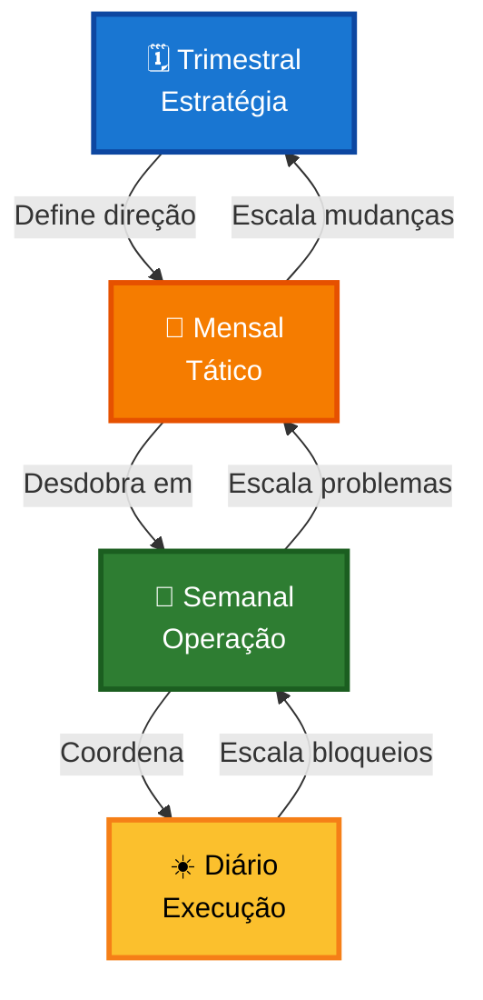

# 🔄 Rituais — Gestão Guiada por Cadência

> **O coração do sistema**: rituais estruturados que transformam caos em clareza.

---

## 💡 O Que São os Rituais?

Os **Rituais** são reuniões estruturadas que acontecem em cadências diferentes (trimestral, mensal, semanal, diário). Cada ritual tem:

- 🎯 **Objetivo específico**
- ⏱️ **Duração definida**
- 📋 **Etapas guiadas**
- ✅ **Saídas objetivas**

!!! tip "Por que 'Rituais' e não 'Reuniões'?"
    Rituais têm **propósito**, **estrutura** e **repetição intencional**. Reuniões podem ser soltas e improdutivas. Rituais geram **resultados**.

---

## 🗓️ Os 4 Rituais do Sistema

### 🗓️ Ritual Trimestral — Estratégia

**Frequência:** A cada 90 dias  
**Duração:** 2-4 horas  
**Objetivo:** Revisar a base do negócio e garantir direção estratégica

**Quando fazer:**

- Início de cada trimestre
- Quando houver mudança significativa no negócio
- Quando estratégia atual não está funcionando

**O que gera:**

- Objetivo principal revisado
- Pilares atualizados
- Prioridades trimestrais
- Decisões estratégicas
- Indicadores principais

→ **[Fazer Ritual Trimestral](trimestral.md)**

---

### 📅 Ritual Mensal — Tático

**Frequência:** A cada 30 dias  
**Duração:** 1-2 horas  
**Objetivo:** Traduzir estratégia em acompanhamento tático

**Quando fazer:**

- Início de cada mês
- Quando houver desvio significativo no plano
- Quando problemas recorrentes aparecem

**O que gera:**

- Plano tático do mês
- Prioridades mensais
- Decisões táticas
- Problemas escalados
- Indicadores atualizados

→ **[Fazer Ritual Mensal](mensal.md)**

---

### 📆 Ritual Semanal — Operação

**Frequência:** A cada 7 dias  
**Duração:** 30-60 minutos  
**Objetivo:** Organizar foco de execução e operação

**Quando fazer:**

- Início de cada semana (segunda-feira)
- Fim de semana (sexta-feira) para fechamento
- Quando houver bloqueios significativos

**O que gera:**

- Foco semanal definido
- Prioridades da semana
- Bloqueios visíveis
- Decisões rápidas
- Quadro atualizado

→ **[Fazer Ritual Semanal](semanal.md)**

---

### ☀️ Ritual Diário — Coordenação

**Frequência:** Todo dia útil  
**Duração:** 10-15 minutos  
**Objetivo:** Dar visibilidade rápida à execução e manter ritmo

**Quando fazer:**

- Todo dia pela manhã (recomendado)
- Ou fim do dia (para planejar amanhã)
- Sempre no mesmo horário

**O que gera:**

- Alinhamento diário
- Bloqueios identificados
- Coordenação clara
- Quadro atualizado

→ **[Fazer Ritual Diário](diario.md)**

---

## 🔄 Como os Rituais Se Conectam

### Fluxo Descendente (Estratégia → Execução)

1. **Trimestral** define objetivos e prioridades estratégicas
2. **Mensal** traduz em planos táticos e entregas
3. **Semanal** organiza execução e foco
4. **Diário** coordena ações imediatas

### Fluxo Ascendente (Execução → Estratégia)

1. **Diário** detecta bloqueios e impedimentos
2. **Semanal** consolida problemas recorrentes
3. **Mensal** trata desvios e ajusta planos
4. **Trimestral** revisa estratégia se necessário

---

## 📊 Comparação dos Rituais

| Ritual | Frequência | Duração | Foco | Participantes |
|--------|------------|---------|------|---------------|
| **🗓️ Trimestral** | 90 dias | 2-4h | Estratégia | Liderança |
| **📅 Mensal** | 30 dias | 1-2h | Tático | Coordenadores |
| **📆 Semanal** | 7 dias | 30-60min | Operação | Equipe |
| **☀️ Diário** | Diário | 10-15min | Coordenação | Todos |

---

## 🎯 Princípios dos Rituais

!!! tip "Cada ritual tem seu lugar"
    Não discuta estratégia no daily. Não resolva bloqueios operacionais no trimestral. Cada ritual tem seu foco.

!!! tip "Saídas objetivas sempre"
    Todo ritual deve gerar algo concreto: decisões, prioridades, ações, indicadores. Nunca termine sem saídas.

!!! tip "Repetição cria disciplina"
    A cadência fixa cria hábito e garante que nada seja esquecido. Consistência é fundamental.

!!! tip "Escale quando necessário"
    Se algo não cabe no ritual atual, escale para o próximo nível. Não force discussões longas.

---

## 🚀 Como Começar

### Passo 1: Faça o Primeiro Trimestral

Comece pelo **[Ritual Trimestral](trimestral.md)** para estabelecer a base:

- Defina objetivo principal
- Estabeleça pilares
- Monte estrutura
- Crie prioridades trimestrais

### Passo 2: Estabeleça o Mensal

Depois de 30 dias, faça o **[Ritual Mensal](mensal.md)**:

- Revise progresso do trimestre
- Defina plano do mês
- Identifique problemas

### Passo 3: Entre no Ritmo Semanal

Toda semana, faça o **[Ritual Semanal](semanal.md)**:

- Planeje a semana
- Feche a semana anterior
- Atualize quadro

### Passo 4: Mantenha o Diário

Todo dia, faça o **[Ritual Diário](diario.md)**:

- Alinhe foco do dia
- Identifique bloqueios
- Coordene execução

---

## ❓ Perguntas Frequentes

??? question "Preciso fazer todos os rituais?"
    **Sim, para o sistema funcionar completamente.**
    
    Mas pode começar gradualmente:

    - Semana 1-2: Trimestral + Semanal
    - Semana 3-4: Adiciona Diário
    - Mês 2: Adiciona Mensal
    
    O importante é criar consistência.

??? question "E se eu pular um ritual?"
    **Não é o fim do mundo, mas...**
    
    - Pular Diário: Perde coordenação e visibilidade
    - Pular Semanal: Perde foco e planejamento
    - Pular Mensal: Perde acompanhamento tático
    - Pular Trimestral: Perde direção estratégica
    
    Quanto mais pula, mais desorganizado fica.

??? question "Posso adaptar os rituais?"
    **Sim!** Adapte ao seu contexto, mas mantenha:
    

    - Cadência regular
    - Etapas estruturadas
    - Saídas objetivas
    - Foco específico de cada ritual

??? question "Como evitar que virem reuniões improdutivas?"
    **Disciplina:**
    
    - Use timer para controlar tempo
    - Siga as etapas guiadas
    - Exija saídas concretas
    - Interrompa discussões que fogem do foco
    - Escale o que não cabe

---

## 📚 Recursos Adicionais

- **[Painel](../painel.md)** — Visão consolidada da empresa
- **[Quadro Kanban](../quadro.md)** — Gestão visual de cartões
- **[Indicadores](../indicadores.md)** — Métricas para acompanhar

---

  <strong>Rituais</strong> — Transforme caos em clareza 🔄

